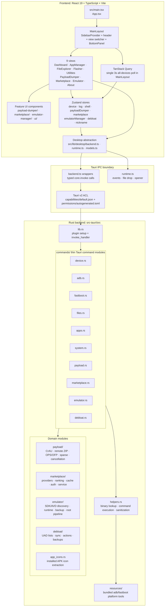

# ADB GUI Next — Agent Instructions

This file is the repository-level working agreement for Codex and other coding agents. Keep it concise, accurate, and practical. Put long-lived rules here; put changing project state in `memory-bank/`.

## Product

ADB GUI Next is a **desktop-only Tauri 2 Android toolkit** for ADB, fastboot, emulator, firmware, debloat, marketplace, and payload-dumper workflows.

Current stack:

- Frontend: React 19, TypeScript 6, Vite 8, Tailwind CSS v4, shadcn/ui, Zustand 5, TanStack Query 5
- Desktop shell: Tauri 2
- Backend: Rust 2024
- Package manager: Bun
- Targets: Windows and Linux first-class; macOS out of scope
- Browser deployment is out of scope. Do not migrate this app to Next.js or web-first routing unless explicitly requested again.

## Start Every Task

1. Read all files in `memory-bank/` before non-trivial work.
2. Inspect the current code before proposing or editing. Do not rely on stale memory.
3. Keep changes surgical. No drive-by refactors, no unrelated formatting churn, no broad cleanup disguised as progress.
4. Define success in commands or reproducible behavior. If a claim cannot be verified, call it an assumption.

## Architecture



Core flow:

```text
UI event -> view/component -> Zustand or local state -> src/lib/desktop/backend.ts -> Tauri invoke -> commands/*.rs -> domain module/helper -> result/event -> store/log/toast
```

## Hard Boundaries

| Concern                          | Correct location                                        | Do not do this                                        |
| -------------------------------- | ------------------------------------------------------- | ----------------------------------------------------- |
| Tauri command surface            | `src-tauri/src/commands/*.rs`                           | Put command handlers inside domain modules            |
| Rust domain logic                | `src-tauri/src/{payload,marketplace,emulator,debloat}/` | Inline complex logic in command wrappers              |
| Shared Rust process/path helpers | `src-tauri/src/helpers.rs`                              | Duplicate command execution or path sanitization      |
| Frontend IPC wrappers            | `src/lib/desktop/backend.ts`                            | Scatter raw `invoke()` calls in components            |
| Tauri events/file drops          | `src/lib/desktop/runtime.ts`                            | Use raw Tauri event APIs directly in views            |
| Frontend DTOs                    | `src/lib/desktop/models.ts`                             | Define Rust IPC shapes inline in components           |
| Shared state                     | `src/lib/*Store.ts`                                     | Recreate shared app state in individual views         |
| shadcn primitives                | `src/components/ui/`                                    | Hand-roll primitive controls for forms/dialogs/tables |
| Feature views                    | `src/components/views/`                                 | Move view orchestration elsewhere without a reason    |
| Feature subcomponents            | `src/components/{feature-name}/`                        | Grow view files into rats nests                       |
| Theme tokens                     | `src/styles/global.css`                                 | Use raw hex/rgb colors in components                  |
| Tests                            | `src/test/*.test.{ts,tsx}`                              | Add frontend tests outside `src/test/`                |

## Commands

| Command                                           | Purpose                                                                          |
| ------------------------------------------------- | -------------------------------------------------------------------------------- |
| `bun run dev`                                     | Vite dev server on port `1420`                                                   |
| `bun run tauri dev`                               | Tauri desktop window + Vite dev server                                           |
| `bun run build`                                   | TypeScript check + Vite build to `dist/`                                         |
| `bun run test`                                    | Vitest frontend tests                                                            |
| `bun run lint:web`                                | Ultracite/Biome check for frontend files                                         |
| `bun run lint:rust`                               | `cargo clippy --manifest-path src-tauri/Cargo.toml --all-targets -- -D warnings` |
| `bun run lint`                                    | Web lint + Rust clippy                                                           |
| `bun run format`                                  | Ultracite/Biome fix + `cargo fmt`                                                |
| `bun run format:check`                            | Ultracite/Biome check + rustfmt check                                            |
| `cargo test --manifest-path src-tauri/Cargo.toml` | Rust tests                                                                       |
| `bun run tauri build --debug`                     | Full debug desktop package                                                       |
| `bun run check`                                   | lint + format check + Rust tests + frontend tests + build                        |

Known Windows issue: bare `cargo test` can fail with Tauri-linked loader error `0xc0000139` / `STATUS_ENTRYPOINT_NOT_FOUND`. Do not call the code broken without confirming whether this known loader issue is the cause.

## Verification Policy

- Source changes require relevant tests plus lint/build for the touched layer.
- Frontend-only source change: run `bun run format:check`, `bun run lint:web`, `bun run test`, and `bun run build`.
- Rust source change: run `bun run format:rust:check`, `bun run lint:rust`, and targeted `cargo test --manifest-path src-tauri/Cargo.toml` when practical.
- IPC contract change: also verify `src/lib/desktop/backend.ts`, `src/lib/desktop/models.ts`, `src-tauri/src/lib.rs`, `src-tauri/src/commands/mod.rs`, and `src-tauri/permissions/autogenerated.toml`.
- Packaging-sensitive change: run `bun run tauri build --debug` or state the exact blocker.
- Docs-only change: run `bun run format:web:check` or a focused Ultracite check on the edited Markdown.
- Never claim success without command output or a clear manual verification note.

## Frontend Rules

- Keep this a Vite/Tauri client app. No `'use client'` directives and no Next.js patterns.
- Use `@/` for project imports. Relative imports are acceptable inside the `desktop/` layer where already established.
- Use `import type` for type-only imports.
- Keep centralized device polling in `MainLayout`; do not add per-view device polling.
- Preserve `MainLayout` view switching with `ViewType` and `VIEW_RENDERERS`; do not introduce a router.
- Error handling for Tauri calls must use `try/catch`, user-visible toast/log feedback, and existing helpers where available.
- Use shadcn/ui primitives and `cn()` for conditional classes.
- Use semantic tokens such as `bg-background`, `text-muted-foreground`, `text-success`, and `text-warning`; do not hardcode colors.
- Use `gap-*`, not `space-x-*` / `space-y-*`.
- Use `size-*` when width and height are equal.
- Icon buttons must have `aria-label`.
- Clickable list rows must be keyboard accessible or be real buttons.
- Search lists using `cmdk` plus virtualization must use `<Command shouldFilter={false}>`.
- Do not use `CommandInput` outside a `<Command>` provider.

## Desktop Layout Rules

- The app is viewport-locked. Keep the `MainLayout` outer boundary as `h-svh overflow-hidden`.
- `SidebarProvider` fills that boundary with `h-full`; do not change it to `min-h-svh`.
- Header stays pinned structurally as a `shrink-0` sibling above the scroll area. Do not add sticky-header hacks.
- Main content scrolling belongs to the `flex-1 overflow-y-auto overflow-x-hidden main-scroll-area` container.
- Use `overflow-x-hidden` on layout containers, not broad `overflow-hidden`.
- Preserve the `min-w-0` chain from shell to truncating text.
- `BottomPanel` resize is DOM-first: update refs/style during drag, commit React state on mouseup only.
- Global Sonner toasts live in `MainLayout` at top-right.

## Rust Rules

- All Tauri commands return `CmdResult<T> = Result<T, String>` unless an existing command has a documented exception.
- Long-running or blocking commands must be `async` and use `tokio::task::spawn_blocking` or `block_in_place` as appropriate.
- Command wrappers stay thin. Put real logic in domain modules.
- New IPC structs exposed to TypeScript need `Serialize` and `#[serde(rename_all = "camelCase")]`.
- Tagged serde enums with `rename_all = "camelCase"` also rename tag values; TypeScript unions must match camelCase strings.
- Use `resolve_binary_path()` for bundled ADB/fastboot. Do not hardcode platform tool paths.
- The Android emulator binary is not bundled; resolve it through the emulator SDK resolver.
- Use `adb_shell_checked()` for critical shell operations. Raw shell success is not proof the inner command succeeded.
- Use `sanitize_filename()` before joining user-provided filename components.
- Tauri v2 app permissions in `src-tauri/permissions/` must be TOML with `[[permission]]`; app permission references in capabilities are unprefixed.

## Feature-Specific Gotchas

- File Explorer: `loadFiles` must keep a stable reference and use refs for history index tracking; adding `historyIndex` to deps causes request loops.
- File Explorer empty state must check `fileList.length === 0 && creatingType === null`; inline create rows need the table to render.
- Tauri drag/drop is window-level. Use one `OnFileDrop()` per page and hit-test refs with cursor coordinates.
- App Manager installed icons are lazy visible-row loads with fixed icon slots; never fetch icons during the initial package list.
- Debloater uses SDK-aware commands. Do not call `pm disable` on SDK < 23; use the existing action builder.
- Marketplace provider logic belongs in provider/service/ranking/cache modules, not command wrappers.
- Emulator AVD discovery scans `~/.android/avd/*.ini`; do not depend on `emulator -list-avds`.
- Emulator root must run readiness checks before automated root. Root is only proven by `verify_avd_root` returning `su -c id -u == 0`.
- Payload extraction is designed around streaming/mmap and cancellation. Do not introduce large in-memory buffers for firmware images.
- OPS/OFP parsing has format-specific crypto and sparse-image rules. Do not “simplify” offsets, key schedules, or sparse expansion without test data.

## Dependency Policy

- Do not add production dependencies without a concrete need and user-visible payoff.
- Prefer existing libraries already in `package.json` / `Cargo.toml`.
- Do not reintroduce Next.js for this desktop app without explicit approval.
- Do not add Electron, routers, global state libraries, CSS frameworks, or broad architecture layers for one feature.

## Review Standard

Call out these patch failures directly:

- Bogus shit: abstraction with no concrete payoff.
- Random churn: formatting, comments, or refactors unrelated to the request.
- Enterprise sludge: factories/managers/builders/config knobs for a simple flow.
- Special-case insanity: conditionals hiding a bad data shape.
- Voodoo programming: retries, sleeps, barriers, or loops added without understanding.
- Hack upon hack: layering new ugliness over old ugliness instead of fixing the data/contract.
- Rats nest code: entangled logic that cannot be tested or reasoned about.

Blunt technical language is allowed. Personal attacks are not.

## Done Means

- The change is scoped to the request.
- The data/IPC shape is clear and documented by types.
- Existing user behavior is preserved unless the user explicitly requested a break.
- Tests or reproducible verification cover the change.
- Lint/format/build status is reported honestly.
- Known unrelated issues are mentioned, not silently “fixed.”


# Ultracite Code Standards

This project uses **Ultracite**, a zero-config preset that enforces strict code quality standards through automated formatting and linting.

## Quick Reference

- **Format code**: `bun x ultracite fix`
- **Check for issues**: `bun x ultracite check`
- **Diagnose setup**: `bun x ultracite doctor`

Biome (the underlying engine) provides robust linting and formatting. Most issues are automatically fixable.

---

## Core Principles

Write code that is **accessible, performant, type-safe, and maintainable**. Focus on clarity and explicit intent over brevity.

### Type Safety & Explicitness

- Use explicit types for function parameters and return values when they enhance clarity
- Prefer `unknown` over `any` when the type is genuinely unknown
- Use const assertions (`as const`) for immutable values and literal types
- Leverage TypeScript's type narrowing instead of type assertions
- Use meaningful variable names instead of magic numbers - extract constants with descriptive names

### Modern JavaScript/TypeScript

- Use arrow functions for callbacks and short functions
- Prefer `for...of` loops over `.forEach()` and indexed `for` loops
- Use optional chaining (`?.`) and nullish coalescing (`??`) for safer property access
- Prefer template literals over string concatenation
- Use destructuring for object and array assignments
- Use `const` by default, `let` only when reassignment is needed, never `var`

### Async & Promises

- Always `await` promises in async functions - don't forget to use the return value
- Use `async/await` syntax instead of promise chains for better readability
- Handle errors appropriately in async code with try-catch blocks
- Don't use async functions as Promise executors

### React & JSX

- Use function components over class components
- Call hooks at the top level only, never conditionally
- Specify all dependencies in hook dependency arrays correctly
- Use the `key` prop for elements in iterables (prefer unique IDs over array indices)
- Nest children between opening and closing tags instead of passing as props
- Don't define components inside other components
- Use semantic HTML and ARIA attributes for accessibility:
  - Provide meaningful alt text for images
  - Use proper heading hierarchy
  - Add labels for form inputs
  - Include keyboard event handlers alongside mouse events
  - Use semantic elements (`<button>`, `<nav>`, etc.) instead of divs with roles

### Error Handling & Debugging

- Remove `console.log`, `debugger`, and `alert` statements from production code
- Throw `Error` objects with descriptive messages, not strings or other values
- Use `try-catch` blocks meaningfully - don't catch errors just to rethrow them
- Prefer early returns over nested conditionals for error cases

### Code Organization

- Keep functions focused and under reasonable cognitive complexity limits
- Extract complex conditions into well-named boolean variables
- Use early returns to reduce nesting
- Prefer simple conditionals over nested ternary operators
- Group related code together and separate concerns

### Security

- Add `rel="noopener"` when using `target="_blank"` on links
- Avoid `dangerouslySetInnerHTML` unless absolutely necessary
- Don't use `eval()` or assign directly to `document.cookie`
- Validate and sanitize user input

### Performance

- Avoid spread syntax in accumulators within loops
- Use top-level regex literals instead of creating them in loops
- Prefer specific imports over namespace imports
- Avoid barrel files (index files that re-export everything)
- Use proper image components (e.g., Next.js `<Image>`) over `` tags

### Framework-Specific Guidance

**Next.js:**
- Use Next.js `<Image>` component for images
- Use `next/head` or App Router metadata API for head elements
- Use Server Components for async data fetching instead of async Client Components

**React 19+:**
- Use ref as a prop instead of `React.forwardRef`

**Solid/Svelte/Vue/Qwik:**
- Use `class` and `for` attributes (not `className` or `htmlFor`)

---

## Testing

- Write assertions inside `it()` or `test()` blocks
- Avoid done callbacks in async tests - use async/await instead
- Don't use `.only` or `.skip` in committed code
- Keep test suites reasonably flat - avoid excessive `describe` nesting

## When Biome Can't Help

Biome's linter will catch most issues automatically. Focus your attention on:

1. **Business logic correctness** - Biome can't validate your algorithms
2. **Meaningful naming** - Use descriptive names for functions, variables, and types
3. **Architecture decisions** - Component structure, data flow, and API design
4. **Edge cases** - Handle boundary conditions and error states
5. **User experience** - Accessibility, performance, and usability considerations
6. **Documentation** - Add comments for complex logic, but prefer self-documenting code

---

Most formatting and common issues are automatically fixed by Biome. Run `bun x ultracite fix` before committing to ensure compliance.

<!-- gitnexus:start -->
# GitNexus — Code Intelligence

This project is indexed by GitNexus as **adb-gui-next** (6438 symbols, 11525 relationships, 300 execution flows). Use the GitNexus MCP tools to understand code, assess impact, and navigate safely.

> If any GitNexus tool warns the index is stale, run `npx gitnexus analyze` in terminal first.

## Always Do

- **MUST run impact analysis before editing any symbol.** Before modifying a function, class, or method, run `gitnexus_impact({target: "symbolName", direction: "upstream"})` and report the blast radius (direct callers, affected processes, risk level) to the user.
- **MUST run `gitnexus_detect_changes()` before committing** to verify your changes only affect expected symbols and execution flows.
- **MUST warn the user** if impact analysis returns HIGH or CRITICAL risk before proceeding with edits.
- When exploring unfamiliar code, use `gitnexus_query({query: "concept"})` to find execution flows instead of grepping. It returns process-grouped results ranked by relevance.
- When you need full context on a specific symbol — callers, callees, which execution flows it participates in — use `gitnexus_context({name: "symbolName"})`.

## Never Do

- NEVER edit a function, class, or method without first running `gitnexus_impact` on it.
- NEVER ignore HIGH or CRITICAL risk warnings from impact analysis.
- NEVER rename symbols with find-and-replace — use `gitnexus_rename` which understands the call graph.
- NEVER commit changes without running `gitnexus_detect_changes()` to check affected scope.

## Resources

| Resource | Use for |
|----------|---------|
| `gitnexus://repo/adb-gui-next/context` | Codebase overview, check index freshness |
| `gitnexus://repo/adb-gui-next/clusters` | All functional areas |
| `gitnexus://repo/adb-gui-next/processes` | All execution flows |
| `gitnexus://repo/adb-gui-next/process/{name}` | Step-by-step execution trace |

## CLI

| Task | Read this skill file |
|------|---------------------|
| Understand architecture / "How does X work?" | `/skills/gitnexus/gitnexus-exploring/SKILL.md` |
| Blast radius / "What breaks if I change X?" | `/skills/gitnexus/gitnexus-impact-analysis/SKILL.md` |
| Trace bugs / "Why is X failing?" | `/skills/gitnexus/gitnexus-debugging/SKILL.md` |
| Rename / extract / split / refactor | `/skills/gitnexus/gitnexus-refactoring/SKILL.md` |
| Tools, resources, schema reference | `/skills/gitnexus/gitnexus-guide/SKILL.md` |
| Index, status, clean, wiki CLI commands | `/skills/gitnexus/gitnexus-cli/SKILL.md` |

<!-- gitnexus:end -->
