# ADB GUI Next — Tauri 2 Android Toolkit

> **Tauri 2 desktop application** for ADB and fastboot workflows.
> React 19 + TypeScript + Vite 8 + Rust (Edition 2024) | Windows & Linux

**RESPECT ALL RULES**: You MUST follow every rule, guideline, principle, coding standard and best practice documented below. No exceptions, no shortcuts, no lazy work, full comprehensive efforts. Respect project patterns, shared contracts, and existing code, ui, colors, patterns style consistency.

## Architecture (Tauri 2 + React + Rust)

```mermaid
graph TB
    subgraph Frontend["Frontend — React 19 + TypeScript + Vite 8"]
        Entry["main.tsx → App.tsx → MainLayout"]
        Views["9 Views: Dashboard · AppManager · FileExplorer · Flasher · Utilities · PayloadDumper · Marketplace · EmulatorManager · About"]
        Stores["8 Zustand Stores: device · log · payloadDumper · debloat · emulatorManager · marketplace · shell · nickname"]
        Desktop["Desktop Layer: backend.ts · runtime.ts · models.ts"]

        Entry --> Views
        Views --> Stores
        Stores --> Desktop
    end

    subgraph IPC["Tauri 2 IPC Bridge"]
        Invoke["backend.ts → core.invoke — 71 Rust commands"]
        Events["runtime.ts → event listeners, file drop, opener"]
        DTOs["models.ts → 383-line TypeScript DTO namespace"]
    end

    subgraph Backend["Backend — Rust src-tauri/"]
        Core["lib.rs — plugin setup + invoke_handler\nhelpers.rs — binary resolution, shell helpers"]

        subgraph Commands["commands/ — 10 Tauri Command Modules"]
            device["device.rs — get_devices, get_device_info, get_device_mode, get_device_sdk, get_fastboot_devices"]
            adb["adb.rs — run_adb_host_command, run_shell_command, wireless ADB"]
            fastboot["fastboot.rs — flash_partition, reboot, wipe_data, set_active_slot, get_bootloader_variables"]
            files["files.rs — list_files, push_file, pull_file, create_directory, create_file, delete_files, rename_file"]
            apps["apps.rs — install_package, uninstall_package, sideload_package, get_installed_packages"]
            system["system.rs — open_folder, launch_terminal, launch_device_manager, save_log"]
            payload_cmd["payload.rs — extract_payload, list_payload_partitions, remote payload, OPS metadata"]
            emulator_cmd["emulator.rs — list/launch/stop AVDs, root_avd, scan readiness, restore"]
            marketplace_cmd["marketplace.rs — search, app_detail, trending, versions, download/install APK, GitHub auth"]
            debloat_cmd["debloat.rs — load lists, get/debloat packages, backup/restore, per-device settings"]
        end

        subgraph Domain["4 Domain Modules"]
            payload_mod["payload/ (8 modules) — OTA parser, extractor, HTTP range, remote ZIP, OPS/OFP decryption"]
            emulator_mod["emulator/ (9 modules) — AVD discovery, Magisk download/packaging, rootAVD pipeline, backups"]
            debloat_mod["debloat/ (5 modules) — UAD list loading, package sync, debloat actions, backup/restore"]
            marketplace_mod["marketplace/ (9 modules) — F-Droid, GitHub, Aptoide providers, ranking, cache, auth"]
        end

        Resources["resources/ — Bundled adb + fastboot binaries"]
    end

    Desktop --> IPC
    IPC --> Core
    Core --> Commands
    Commands --> Domain
    Core --> Resources
```



- **Desktop abstraction**: `src/lib/desktop/backend.ts` wraps every Tauri command (55+ exported functions). `runtime.ts` manages event listeners with cleanup tracking. `models.ts` defines all DTOs.
- **State**: Zustand 5 for in-memory shared state (8 stores). `nicknameStore` uses localStorage. TanStack Query 5 for centralized device polling (3s interval).
- **Navigation**: No router. `MainLayout` uses `useState<ViewType>` + `VIEW_RENDERERS` record map with `AnimatePresence` transitions.
- **Binary resolution**: Three-tier fallback: Tauri resource dir → repo `resources/` → system PATH.
- **IPC pattern**: All commands are `#[tauri::command]` functions in `commands/` modules, registered in `lib.rs` `invoke_handler`. Frontend calls via `backend.ts` → `core.invoke()`.

---

## Project Structure

```text
├── src/                              # Frontend — React 19 + TypeScript + Vite 8
│   ├── components/                   # UI components
│   │   ├── ui/                       # 40 shadcn/ui primitives (button, card, dialog, etc.)
│   │   ├── views/                    # 9 view components + debloater sub-views
│   │   ├── emulator-manager/         # Rooting wizard (9 sub-components)
│   │   ├── marketplace/              # App discovery (9 sub-components)
│   │   ├── payload-dumper/           # Payload extraction (10 sub-components)
│   │   └── shared/                   # Currently empty — reserved
│   ├── lib/                          # Business logic layer
│   │   ├── desktop/                  # Tauri abstraction (backend.ts, runtime.ts, models.ts)
│   │   ├── *Store.ts                 # 8 Zustand stores
│   │   ├── queries.ts                # TanStack Query keys + fetchers
│   │   └── utils.ts                  # cn(), formatting, helpers
│   ├── hooks/                        # React hooks (use-mobile.ts)
│   ├── styles/                       # global.css — Tailwind v4 + OKLCH theme tokens
│   └── test/                         # 19 test files (Vitest + React Testing Library)
│
├── src-tauri/                        # Rust backend — Tauri 2
│   ├── src/
│   │   ├── lib.rs                    # App entry + plugin setup (122 lines)
│   │   ├── helpers.rs                # Binary resolution, command execution (321 lines)
│   │   ├── commands/                 # 10 Tauri command modules (mod.rs + 10 files)
│   │   ├── payload/                  # OTA parser + OPS/OFP decryption (8+ modules)
│   │   ├── emulator/                 # AVD management + Magisk rooting (9 modules)
│   │   ├── debloat/                  # UAD integration (5 modules)
│   │   ├── marketplace/              # App discovery providers (9 modules)
│   │   └── generated/                # Protobuf generated code
│   ├── capabilities/                 # Tauri permission grants (default.json)
│   ├── permissions/                  # TOML-based command ACL (autogenerated.toml)
│   ├── resources/                    # Bundled adb/fastboot binaries (windows/ + linux/)
│   └── icons/                        # App icons (all platforms)
```

---

## Critical Rules

### File & Module Boundaries

| Type                       | Correct Location                  | Wrong                                      |
| -------------------------- | --------------------------------- | ------------------------------------------ |
| Tauri command handlers     | `src-tauri/src/commands/*.rs`     | Putting handlers in domain modules         |
| Domain logic (payload)     | `src-tauri/src/payload/`          | Inline domain code in command handlers     |
| Domain logic (emulator)    | `src-tauri/src/emulator/`         | Inline emulator logic in commands          |
| Domain logic (debloat)     | `src-tauri/src/debloat/`          | Inline debloat logic in commands           |
| Domain logic (marketplace) | `src-tauri/src/marketplace/`      | Inline marketplace logic in commands       |
| Shared Rust helpers        | `src-tauri/src/helpers.rs`        | Duplicating helpers across modules         |
| Frontend Tauri wrappers    | `src/lib/desktop/backend.ts`      | Direct `invoke()` calls scattered in views |
| Event system wrappers      | `src/lib/desktop/runtime.ts`      | Raw Tauri event API in components          |
| TypeScript DTOs            | `src/lib/desktop/models.ts`       | Inline type definitions in views           |
| Zustand stores             | `src/lib/*Store.ts`               | Component-local state for shared data      |
| shadcn UI primitives       | `src/components/ui/`              | Custom-styled divs for UI primitives       |
| View components            | `src/components/views/`           | View logic outside views/ directory        |
| View sub-components        | `src/components/{feature-name}/`  | Inlining complex logic in view files       |
| Shared feature components  | `src/components/`                 | Duplicating components across views        |
| Bundled Android binaries   | `src-tauri/resources/{platform}/` | Hardcoded system paths for adb/fastboot    |
| Tailwind theme tokens      | `src/styles/global.css`           | Hardcoded color values in components       |
| Test files                 | `src/test/*.test.{ts,tsx}`        | Tests outside the test directory           |

---

## Commands & Quality Gates

| Command                       | What it does                                                      |
| ----------------------------- | ----------------------------------------------------------------- |
| `bun run dev`                 | Vite dev server on port 1420                                      |
| `bun run tauri dev`           | Vite dev server + Tauri desktop window                            |
| `bun run build`               | tsc type-check + Vite bundle → `dist/`                            |
| `bun run tauri build --debug` | Full Tauri build (debug — Windows MSI + NSIS)                     |
| `bun run tauri build`         | Full Tauri build (release)                                        |
| `bun run lint`                | ESLint (web) + cargo clippy (Rust, -D warnings)                   |
| `bun run lint:web`            | ESLint only                                                       |
| `bun run lint:web:fix`        | ESLint auto-fix                                                   |
| `bun run lint:rust`           | cargo clippy -D warnings                                          |
| `bun run format`              | Prettier (web) + cargo fmt (Rust)                                 |
| `bun run format:check`        | Check-only (CI mode)                                              |
| `bun run format:web`          | Prettier auto-fix                                                 |
| `bun run format:rust`         | cargo fmt --all                                                   |
| `bun run test`                | Vitest — run all frontend tests                                   |
| `bun run test:watch`          | Vitest in watch mode                                              |
| `bun run test:coverage`       | Vitest with v8 coverage                                           |
| `bun run check`               | Full gate: lint → format:check → cargo test → vitest → vite build |
| `bun run check:fast`          | Fast gate: lint → format:check (no build, no tests)               |

**Tests:**

- **Frontend**: Vitest + jsdom + React Testing Library (19 test files in `src/test/`)
- **Rust**: `cargo test --manifest-path src-tauri/Cargo.toml` (helpers, payload parser, OPS decryption)

---

## Pre-Commit Checklist

**ZERO-TOLERANCE**: Run ALL gates in order every time you touch any source file. A single failure means the task is NOT done. Fix the root cause — never suppress or ignore.

```bash
bun run format:check                  # Gate 1: Format
# If fails → bun run format, then re-check

bun run lint                          # Gate 2: Lint (ESLint + cargo clippy -D warnings)
bun run test                          # Gate 3: Frontend tests (Vitest)
cargo test --manifest-path src-tauri/Cargo.toml  # Gate 4: Rust tests
bun run build                         # Gate 5: Type check + Vite build
bun run tauri build --debug           # Gate 6: Full build (packaging + resource bundling)

bun run check                         # All-in-one: runs gates 1-5
```

---

## Coding Standards — TypeScript/React

### Formatting & Style

| Setting         | Value                  |
| --------------- | ---------------------- |
| Formatter       | Prettier               |
| Print width     | 100 characters         |
| Semicolons      | Yes                    |
| Quotes          | Single                 |
| Trailing commas | All                    |
| Indent          | 2 spaces               |
| Line endings    | LF (via .editorconfig) |

### Imports

- Use `@/` alias for project imports: `@/lib/logStore`, `@/components/ui/button`
- Use relative imports for `desktop/` layer from views: `../../lib/desktop/backend`
- Type imports: use `import type` (enforced by `@typescript-eslint/consistent-type-imports`)

### Naming Conventions

| Type           | Convention                 | Example                             |
| -------------- | -------------------------- | ----------------------------------- |
| Components     | PascalCase                 | `MainLayout`, `ViewDashboard`       |
| Views          | PascalCase + `View` prefix | `ViewFlasher`, `ViewMarketplace`    |
| Hooks          | camelCase + `use` prefix   | `useDeviceStore`, `useLogStore`     |
| Zustand stores | camelCase + `use` prefix   | `useDeviceStore`, `useDebloatStore` |
| Tauri wrappers | PascalCase                 | `GetDevices`, `RunAdbHostCommand`   |
| Functions      | camelCase                  | `refreshDevices`, `addLog`          |
| Constants      | SCREAMING_SNAKE_CASE       | `LOADING_DURATION`, `VIEWS`         |
| CSS classes    | Tailwind utility classes   | `flex gap-4 bg-background`          |

### shadcn/ui Conventions

- Use `cn()` for conditional classes (clsx + tailwind-merge)
- Use semantic tokens: `bg-background`, `text-muted-foreground` — never raw hex/rgb
- Use `gap-*` not `space-x-*`/`space-y-*`
- Use `size-*` when width and height are equal
- Full Card composition: `CardHeader`/`CardTitle`/`CardDescription`/`CardContent`/`CardFooter`
- Toasts via sonner: `toast.success()` / `toast.error()`

---

## Key Patterns

| Pattern                     | Implementation                                                                             |
| --------------------------- | ------------------------------------------------------------------------------------------ |
| **View switching**          | `useState<ViewType>` + `VIEW_RENDERERS` record map in `MainLayout` — no router             |
| **Device polling**          | Centralized TanStack Query (3s `refetchInterval`) in `MainLayout` — single source of truth |
| **Error handling (FE)**     | Every Tauri call wrapped in try/catch → `toast.error()` + `addLog()`                       |
| **Error handling (Rust)**   | `CmdResult<T> = Result<T, String>` — all commands return this                              |
| **Binary execution**        | `resolve_binary_path()` → `run_binary_command()` — three-tier lookup                       |
| **Payload extraction**      | CrAU header → protobuf manifest → per-operation decompress (XZ/BZ2/Zstd/Zero) → SHA-256    |
| **OPS/OFP firmware**        | AES-CFB decryption → scatter format parsing → sparse image expansion                       |
| **Remote payload**          | HTTP range requests → partial ZIP parsing → streaming extraction without full download     |
| **Event system**            | `runtime.ts` wraps Tauri events with cleanup tracking via `Map<string, Set<...>>`          |
| **Config write path**       | UI → Zustand store → backend.ts → Tauri invoke → Rust command → process execution          |
| **State persistence**       | Zustand for in-memory, localStorage for nicknames only                                     |
| **Component reuse**         | `ConnectedDevicesCard`, `DeviceSwitcher`, `ActionButton` shared across views               |
| **Component decomposition** | PayloadDumper (10 sub-components), EmulatorManager (9), Marketplace (9), Debloater (5)     |
| **Emulator rooting**        | 4-step wizard: Preflight → Source → Progress → Result with rootAVD-aligned pipeline        |

---

### Manual Verification Checklist

Before closing any task, confirm ALL of the following:

- [ ] `bun run check` passes (lint + format + tests + build)
- [ ] No `'use client'` directives (this is Vite/Tauri, not Next.js)
- [ ] No unused imports or variables (ESLint catches these)
- [ ] Rust: all new structs have `#[derive(Serialize)]` with `#[serde(rename_all = "camelCase")]`
- [ ] Rust: all commands return `CmdResult<T>`
- [ ] Rust: new commands added to `commands/mod.rs` re-exports AND `lib.rs` `invoke_handler`
- [ ] Rust: new commands added to `permissions/autogenerated.toml` allow-list
- [ ] FE: new Tauri commands wrapped in `src/lib/desktop/backend.ts`
- [ ] FE: new DTOs added to `src/lib/desktop/models.ts`
- [ ] FE: error handling wraps Tauri calls in try/catch with toast + log
- [ ] FE: uses `@/` alias for project imports (not relative paths for non-desktop imports)
- [ ] FE: uses `cn()` for conditional Tailwind classes (not manual template literals)
- [ ] FE: uses semantic color tokens (not hardcoded colors)
- [ ] No dead code or unused dependencies introduced

---

### Hard Failure Rules

| Gate                   | Rule                                                                        |
| ---------------------- | --------------------------------------------------------------------------- |
| **format:check fails** | Run `bun run format`, then verify `bun run format:check` is clean.          |
| **lint errors**        | Fix the code. Never suppress lint warnings without a written justification. |
| **build fails**        | Fix the build. Do not hand off a broken build under any circumstances.      |
| **type errors**        | Fix TypeScript types. Never use `any` without explicit justification.       |
| **test failures**      | Fix the failing test or the code. Never skip or delete tests to pass CI.    |
| **module too large**   | When adding commands, use the existing modular pattern in `commands/`.      |
