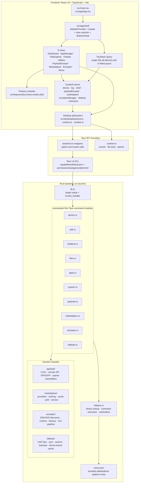

# ADB GUI Next — Agent Instructions

This file is the repository-level working agreement for Codex and other coding agents. Keep it concise, accurate, and practical. Put long-lived rules here; put changing project state in `memory-bank/`.

## Product

ADB GUI Next is a **desktop-only Tauri 2 Android toolkit** for ADB, fastboot, emulator, firmware, debloat, marketplace, and payload-dumper workflows.

Current stack:

- Frontend: React 19, TypeScript 6, Vite 8, Tailwind CSS v4, shadcn/ui, Zustand 5, TanStack Query 5
- Desktop shell: Tauri 2
- Backend: Rust 2024
- Package manager: Bun
- Targets: Windows and Linux first-class; macOS out of scope
- Browser deployment is out of scope. Do not migrate this app to Next.js or web-first routing unless explicitly requested again.

## Start Every Task

1. Read all files in `memory-bank/` before non-trivial work.
2. For architecture/layer questions, prefer `docs/architecture.md` + live code over memory alone.
3. Inspect the current code before proposing or editing. Do not rely on stale memory.
4. Keep changes surgical. No drive-by refactors, no unrelated formatting churn, no broad cleanup disguised as progress.
5. Define success in commands or reproducible behavior. If a claim cannot be verified, call it an assumption.

## Architecture


```mermaid
flowchart TB
    subgraph FE["Frontend: React 19 + TypeScript + Vite"]
        entry["src/main.tsx<br/>src/app/App.tsx"]
        shell["src/app/shell<br/>SidebarProvider + header + view switcher + BottomPanel"]
        views["9 views<br/>Dashboard · AppManager · FileExplorer · Flasher · Utilities<br/>PayloadDumper · Marketplace · Emulator · About"]
        featureUI["Feature modules<br/>src/features/<feature>/{ui,hooks,model,utils}"]
        stores["Zustand stores<br/>device · log · shell · payloadDumper · marketplace<br/>emulatorManager · debloat · nickname"]
        query["TanStack Query<br/>single 30s all-devices poll in MainLayout"]
        desktop["Desktop abstraction<br/>src/desktop/backend.ts · runtime.ts · models.ts"]

        entry --> shell
        shell --> views
        shell --> query
        views --> featureUI
        views --> stores
        query --> stores
        stores --> desktop
        views --> desktop
    end

    subgraph IPC["Tauri IPC boundary"]
        invoke["backend.ts wrappers<br/>typed core.invoke calls"]
        events["runtime.ts<br/>events · file drop · opener"]
        acl["Tauri v2 ACL<br/>capabilities/default.json + permissions/autogenerated.toml"]
    end

    subgraph BE["Rust backend: src-tauri/src"]
        app["lib.rs<br/>plugin setup + invoke_handler"]
        helpers["helpers.rs<br/>binary lookup · command execution · sanitization"]

        subgraph commands["commands/ thin Tauri command modules"]
            c_device["device.rs"]
            c_adb["adb.rs"]
            c_fastboot["fastboot.rs"]
            c_files["files.rs"]
            c_apps["apps.rs"]
            c_system["system.rs"]
            c_payload["payload.rs"]
            c_market["marketplace.rs"]
            c_emulator["emulator.rs"]
            c_debloat["debloat.rs"]
        end

        subgraph domain["Domain modules"]
            d_payload["payload/<br/>CrAU · remote ZIP · OPS/OFP · sparse · cancellation"]
            d_market["marketplace/<br/>providers · ranking · cache · auth · service"]
            d_emulator["emulator/<br/>SDK/AVD discovery · runtime · backup · root pipeline"]
            d_debloat["debloat/<br/>UAD lists · sync · actions · backups · device-keyed cache"]
        end

        resources["resources/<br/>bundled adb/fastboot platform tools"]
    end

    desktop --> invoke
    desktop --> events
    invoke --> acl
    acl --> app
    app --> commands
    commands --> helpers
    commands --> domain
    helpers --> resources
```

Core flow:

```text
UI event -> feature view/component -> Zustand or local state -> src/desktop/backend.ts -> Tauri invoke -> commands/*.rs -> domain module/helper -> result/event -> store/log/toast
```

## Hard Boundaries

| Concern | Correct location | Do not do this |
| --- | --- | --- |
| App bootstrap | `src/main.tsx`, `src/app/App.tsx` | Put feature logic in bootstrap |
| App shell and view switching | `src/app/shell/` | Add a router or per-view polling |
| Tauri command surface | `src-tauri/src/commands/*.rs` | Put command handlers inside domain modules |
| Rust domain logic | `src-tauri/src/{payload,marketplace,emulator,debloat}/` | Inline complex logic in command wrappers |
| Shared Rust process/path helpers | `src-tauri/src/helpers.rs` | Duplicate command execution or path sanitization |
| Tauri IPC wrappers | `src/desktop/backend.ts` | Scatter raw `invoke()` calls in features |
| Tauri events/file drops | `src/desktop/runtime.ts` | Use raw Tauri event APIs directly in views |
| Frontend DTOs | `src/desktop/models.ts` | Define Rust IPC shapes inline in components |
| shadcn primitives | `src/shared/ui/` | Hand-roll primitive controls |
| Cross-feature components | `src/shared/components/` | Put feature-only UI in shared |
| Cross-feature stores | `src/shared/stores/` | Put feature state in app-wide stores |
| Feature implementation | `src/features/<feature>/` | Add new code under legacy `components/views` |
| Feature hooks | `src/features/<feature>/hooks/` | Hide stateful feature logic in view files |
| Feature utilities | `src/features/<feature>/utils/` | Create generic `utils.ts` dumping grounds |
| Theme tokens | `src/styles/global.css` | Use raw hex/rgb colors in components |
| Tests | `src/test/` | Add frontend tests outside `src/test/` |

## Commands

| Command | Purpose |
| --- | --- |
| `bun run dev` | Vite dev server on port `1420` |
| `bun run tauri dev` | Tauri desktop window + Vite dev server |
| `bun run build` | TypeScript check + Vite build to `dist/` |
| `bun run test` | Vitest frontend tests |
| `bun run lint:web` | Ultracite/Biome check (frontend format + lint) |
| `bun run lint:rust` | `cargo clippy --all-targets -- -D warnings` (`src-tauri` `[lints]` + `clippy.toml`) |
| `bun run lint` | Web check + Rust clippy |
| `bun run format:web` | Ultracite fix (frontend) |
| `bun run format:rust` | `cargo fmt` (Rust) |
| `bun run format:rust:check` | `cargo fmt --check` only |
| `bun run format` | Ultracite fix + `cargo fmt` |
| `bun run format:check` | Ultracite check + rustfmt check (CI) |
| `bun run check` | Full local gate: format:check → clippy → vitest → cargo test → build |
| `cargo test --manifest-path src-tauri/Cargo.toml` | Rust tests |
| `bun run tauri build --debug` | Full debug desktop package |

**Script model (keep it simple):**

| Intent | Command | Engine |
| --- | --- | --- |
| Web format/lint check | `lint:web` | Ultracite (`ultracite check`) |
| Web auto-fix | `format:web` | Ultracite (`ultracite fix`) |
| Rust lint | `lint:rust` | Clippy |
| Rust format | `format:rust` / `format:rust:check` | rustfmt |
| Pre-commit | Husky → `lint-staged` | staged Ultracite fix + staged `cargo fmt` |
| CI quality | `format:check` + `lint` + `test` + cargo test + `build` | same tools |

Do **not** reintroduce alias scripts (`fix`, `lint:fix`, `lint:web:fix`, `format:web:check`, `check:fast`) — they duplicated Ultracite under different names.

Known Windows issue: bare `cargo test` can fail with Tauri-linked loader error `0xc0000139` / `STATUS_ENTRYPOINT_NOT_FOUND`. Do not call the code broken without confirming whether this known loader issue is the cause. On Windows, prefer `cargo test --manifest-path src-tauri/Cargo.toml --no-run` plus Linux CI for execution when the loader issue appears.

## Verification Policy

- **Full gate (`bun run check`) only after every task in the request is done — never mid-task or between partial steps.**
- Source changes require relevant tests plus lint/build for the touched layer.
- Frontend-only source change: run `bun run lint:web`, `bun run test`, and `bun run build` (format is covered by `lint:web` / Ultracite check).
- Rust source change: run `bun run format:rust:check`, `bun run lint:rust`, and targeted `cargo test --manifest-path src-tauri/Cargo.toml` when practical.
- Full gate before merge: `bun run check` (or the CI equivalent steps). Note: `check` runs `cargo test`, which may hit the known Windows loader issue.
- IPC contract change: also verify `src/desktop/backend.ts`, `src/desktop/models.ts`, `src-tauri/src/lib.rs`, `src-tauri/src/commands/mod.rs`, and `src-tauri/permissions/autogenerated.toml`.
- Packaging-sensitive change: run `bun run tauri build --debug` or state the exact blocker.
- Docs-only change: run `bun run lint:web` if the edited Markdown is under Ultracite includes; otherwise skip.
- Never claim success without command output or a clear manual verification note.

## Frontend Rules

- Keep this a Vite/Tauri client app. No `'use client'` directives and no Next.js patterns.
- Use `@/` for project imports. Relative imports are acceptable inside the `desktop/` layer where already established.
- Use `import type` for type-only imports.
- Keep centralized device polling in `MainLayout`; do not add per-view device polling.
- Preserve `MainLayout` view switching with `ViewType` and `VIEW_RENDERERS`; do not introduce a router.
- Error handling for Tauri calls must use `try/catch`, user-visible toast/log feedback, and existing helpers where available.
- Use shadcn/ui primitives and `cn()` for conditional classes.
- Use semantic tokens such as `bg-background`, `text-muted-foreground`, `text-success`, and `text-warning`; do not hardcode colors.
- Use `gap-*`, not `space-x-*` / `space-y-*`.
- Use `size-*` when width and height are equal.
- Icon buttons must have `aria-label`.
- Clickable list rows must be keyboard accessible or be real buttons.
- Search lists using `cmdk` plus virtualization must use `<Command shouldFilter={false}>`.
- Do not use `CommandInput` outside a `<Command>` provider.

## Desktop Layout Rules

- The app is viewport-locked. Keep the `MainLayout` outer boundary as `h-svh overflow-hidden`.
- `SidebarProvider` fills that boundary with `h-full`; do not change it to `min-h-svh`.
- Header stays pinned structurally as a `shrink-0` sibling above the scroll area. Do not add sticky-header hacks.
- Main content scrolling belongs to the `flex-1 overflow-y-auto overflow-x-hidden main-scroll-area` container.
- Use `overflow-x-hidden` on layout containers, not broad `overflow-hidden`.
- Preserve the `min-w-0` chain from shell to truncating text.
- `BottomPanel` resize is DOM-first: update refs/style during drag, commit React state on mouseup only.
- Global Sonner toasts live in `MainLayout` at top-right.

## Rust Rules

- All Tauri commands return `CmdResult<T> = Result<T, String>` unless an existing command has a documented exception.
- Long-running or blocking commands must be `async` and use `tokio::task::spawn_blocking` or `block_in_place` as appropriate.
- Command wrappers stay thin. Put real logic in domain modules.
- New IPC structs exposed to TypeScript need `Serialize` and `#[serde(rename_all = "camelCase")]`.
- Tagged serde enums with `rename_all = "camelCase"` also rename tag values; TypeScript unions must match camelCase strings.
- Use `resolve_binary_path()` for bundled ADB/fastboot. Do not hardcode platform tool paths.
- The Android emulator binary is not bundled; resolve it through the emulator SDK resolver.
- Use `helpers::adb_shell_checked()` for critical shell operations (file mutations and root pipeline). Raw ADB host success is not proof the inner shell command succeeded.
- Use `sanitize_filename()` / `safe_image_file_name()` before joining user-provided or firmware-manifest filename components. Never write extract outputs from raw partition names.
- Payload remote HTTP clients must not auto-follow redirects; re-run `validate_outbound_url` on every hop (same pattern as marketplace downloads).
- Debloat cache entries must be keyed by device serial; never return another device's packages/settings after a switch.
- Refuse destructive debloat actions when Android SDK cannot be determined (`try_get_android_sdk`). Do not map Disable → Uninstall on unknown or API &lt; 23.
- Tauri v2 app permissions in `src-tauri/permissions/` must be TOML with `[[permission]]`; app permission references in capabilities are unprefixed. Keep `commands.allow` in sync with `generate_handler!` (no orphan allowlist entries).

## Feature-Specific Gotchas

- File Explorer: `loadFiles` must keep a stable reference and use refs for history index tracking; adding `historyIndex` to deps causes request loops. Mutations that re-list the same path must call `loadFiles(path, false)`.
- File Explorer empty state must check `fileList.length === 0 && creatingType === null`; inline create rows need the table to render.
- File Explorer transfers/delete must snapshot `serial` (and path) at action start before host dialogs; clear root grant immediately on serial change before re-verify.
- Tauri drag/drop is window-level. Use one `OnFileDrop()` per page and hit-test refs with cursor coordinates on **both hover and drop**.
- App Manager installed icons: product currently uses Lucide placeholders in the virtualized list; if reintroducing APK icon extraction, keep lazy visible-row loads with fixed icon slots and never fetch during the initial package list.
- Debloater uses SDK-aware commands. Do not call bare `pm disable` on any SDK; use the existing action builder. Reload debloat data when `selectedSerial` changes. DTO field is camelCase `listStatus`.
- Marketplace provider logic belongs in provider/service/ranking/cache modules, not command wrappers. `marketplace_install_apk` must pass selected device serial and only install owned marketplace temp downloads. PAT/OAuth access token stay session-only (not localStorage).
- Emulator AVD discovery scans `~/.android/avd/*.ini`; do not depend on `emulator -list-avds`.
- Emulator root must run readiness checks before automated root. Root is only proven by `verify_avd_root` returning `su -c id -u == 0`. Magisk "latest" fetches GitHub `/releases/latest` with v25.2 offline fallback; prefer local rootAVD zip when present.
- Payload extraction is designed around streaming/mmap and cancellation. Do not introduce large in-memory buffers for firmware images. Invalid cancel token IDs must error (never run uncancellable). `TransactionGuard` deletes registered files only — never `remove_dir_all` on user-chosen output directories.
- OPS/OFP parsing has format-specific crypto and sparse-image rules. Do not "simplify" offsets, key schedules, or sparse expansion without test data.
- Root progress events: subscribe via `EventsOn` in `src/desktop/runtime.ts`, not raw `@tauri-apps/api/event` in feature UI.

## Dependency Policy

- Do not add production dependencies without a concrete need and user-visible payoff.
- Prefer existing libraries already in `package.json` / `Cargo.toml`.
- Do not reintroduce Next.js for this desktop app without explicit approval.
- Do not add Electron, routers, global state libraries, CSS frameworks, or broad architecture layers for one feature.

## Review Standard

Blunt technical language is allowed. Personal attacks are not. Call out these patch failures directly:

- **Bogus shit**: abstraction with no concrete payoff.
- **Random churn**: formatting, comments, or refactors unrelated to the request.
- **Enterprise sludge**: factories/managers/builders/config knobs for a simple flow.
- **Special-case insanity**: conditionals hiding a bad data shape.
- **Voodoo programming**: retries, sleeps, barriers, or loops added without understanding.
- **Hack upon hack**: layering new ugliness over old ugliness instead of fixing the data/contract.
- **Rats nest code**: entangled logic that cannot be tested or reasoned about.

A change is done when:

- The change is scoped to the request.
- The data/IPC shape is clear and documented by types.
- Existing user behavior is preserved unless the user explicitly requested a break.
- Tests or reproducible verification cover the change.
- Lint/format/build status is reported honestly.
- Known unrelated issues are mentioned, not silently "fixed."