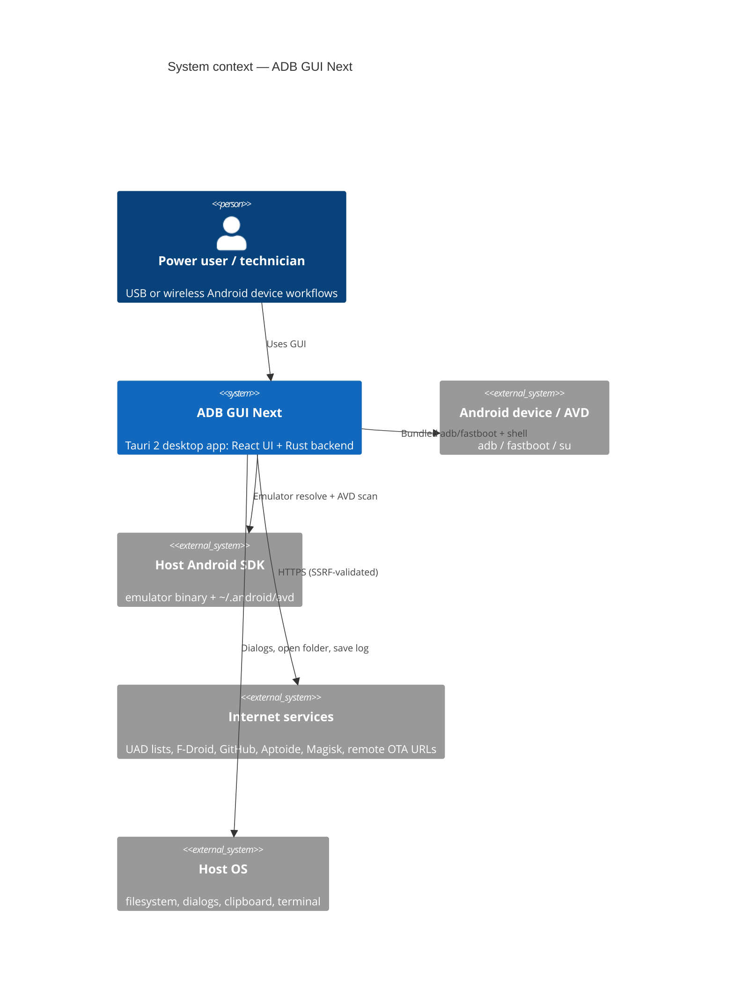
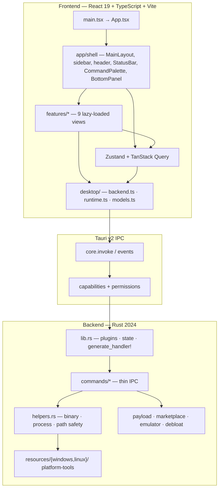
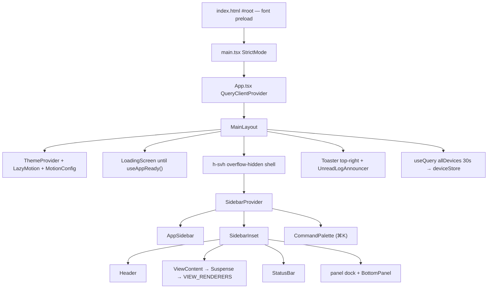
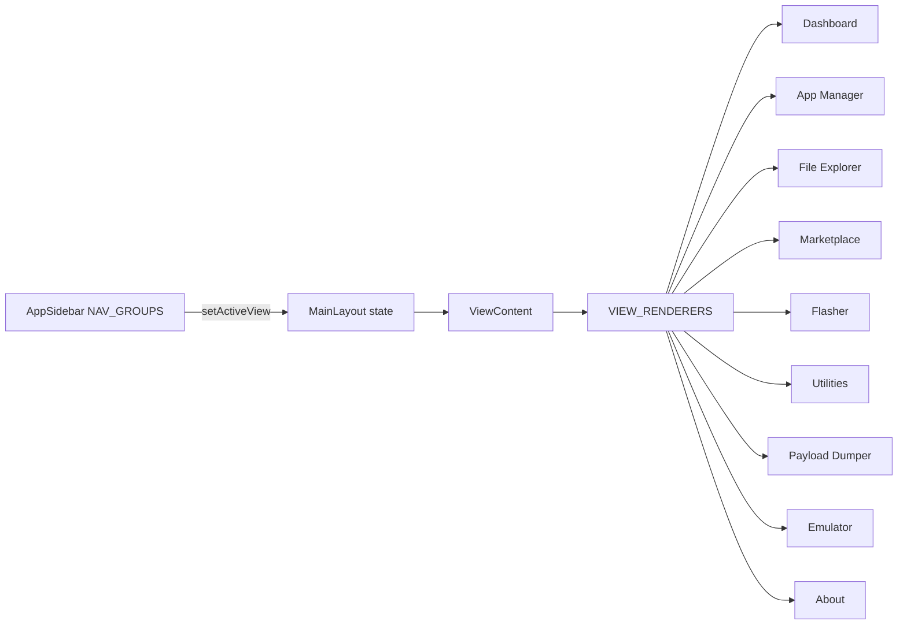
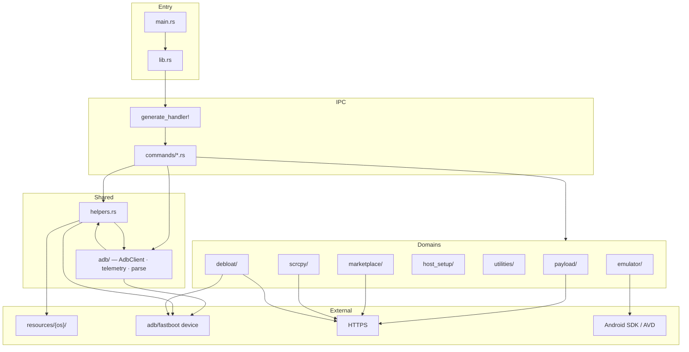
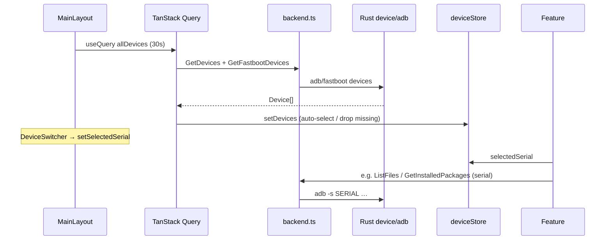
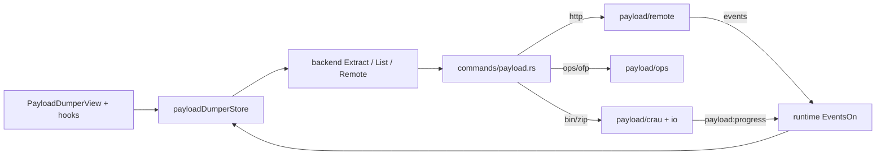
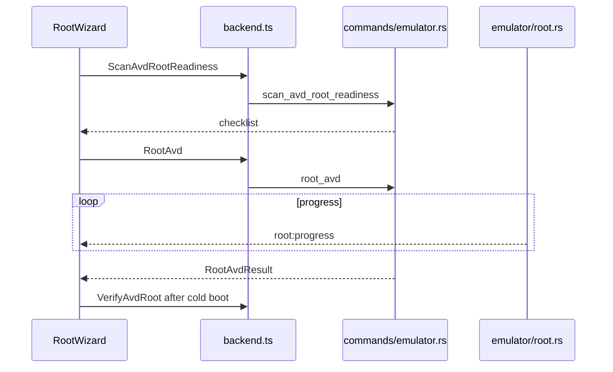

# ADB GUI Next — Architecture

> **Owns:** cross-module design, data flow, and IPC contracts (not agent workflow).  
> **Product:** Desktop toolkit for ADB, fastboot, firmware extraction, debloat, marketplace, and emulator workflows  
> **Version:** 0.2.5  
> **Stack:** Tauri 2 · React 19 · TypeScript · Vite 8 · Rust 2024 · Bun  
> **Platforms:** Windows (x64/x86/ARM64) & Linux x64 first-class · macOS code present, builds paused  
> **Source of truth:** This document describes the **current** tree under `src/` and `src-tauri/`.

---

## Table of contents

1. [Purpose and scope](#1-purpose-and-scope)
2. [System context](#2-system-context)
3. [High-level architecture](#3-high-level-architecture)
4. [Technology stack](#4-technology-stack)
5. [Repository layout](#5-repository-layout)
6. [Frontend architecture](#6-frontend-architecture)
7. [Desktop IPC layer](#7-desktop-ipc-layer)
8. [Rust backend architecture](#8-rust-backend-architecture)
9. [Feature map (end-to-end)](#9-feature-map-end-to-end)
10. [Cross-cutting data flows](#10-cross-cutting-data-flows)
11. [Security and safety model](#11-security-and-safety-model)
12. [UI shell and layout model](#12-ui-shell-and-layout-model)
13. [Quality, tooling, and CI](#13-quality-tooling-and-ci)
14. [Architectural decisions](#14-architectural-decisions)
15. [Known limitations](#15-known-limitations)
16. [Where to change what](#16-where-to-change-what)

---

## 1. Purpose and scope

ADB GUI Next is a **native desktop application** (not a web product). It wraps Android platform tools and domain logic behind a modern React UI:

| Capability | Summary |
| --- | --- |
| Device control | Discover ADB/fastboot devices, select target, view info, wireless ADB |
| App Manager | Install / uninstall packages; Universal Android Debloater (UAD) integration |
| File Explorer | Dual-pane browse (Places + Root/Storage tree), Details list, push/pull, mutate, optional verified root mode |
| Flasher | Fastboot flash, recovery sideload, wipe, A/B slot |
| Utilities | Reboot modes, host tools, Windows Google platform-tools/USB setup, bootloader vars, terminal/device manager launch |
| Payload Dumper | Local/remote OTA `payload.bin`, factory ZIPs, OnePlus OPS, Oppo OFP |
| Marketplace | Discover/install APKs from F-Droid, GitHub, Aptoide (+ optional GitHub auth) |
| Scrcpy | Download official binaries, launch a native mirror window for the selected serial |
| Emulator Manager | AVD list/launch/stop, Magisk root wizard, backup restore |
| Bottom panel | Logs + adb/fastboot shell (VS Code–style) |
| Command palette | ⌘/Ctrl+K over navigation, device selection, shell/log actions, shortcut reference |
| Status bar | Persistent ADB-server state, selected device, active long-running operation |

**Out of scope:** browser deployment, Next.js routing, Electron. **macOS:** implementation may exist; **builds/shipping paused** until explicitly unpaused (`docs/project_rules.md`).

---

## 2. System context



### ASCII — external actors

```text
                    ┌──────────────────────┐
                    │   User (desktop UI)  │
                    └──────────┬───────────┘
                               │
                    ┌──────────▼───────────┐
                    │    ADB GUI Next      │
                    │  React  │  Rust      │
                    └─┬────┬────┬────┬─────┘
          bundled     │    │    │    │
          adb/fastboot│    │    │    │ HTTPS (validated)
                      │    │    │    │
          ┌───────────▼┐ ┌─▼──┐ │  ┌─▼──────────────┐
          │ Device/AVD │ │SDK │ │  │ UAD / market / │
          │ ADB shell  │ │AVD │ │  │ Magisk / OTA   │
          └────────────┘ └────┘ │  └────────────────┘
                                │
                         ┌──────▼──────┐
                         │ Host OS FS  │
                         │ dialogs     │
                         └─────────────┘
```

---

## 3. High-level architecture

The system is a **layered Tauri 2 app**: UI never shells out directly; all process and domain work is Rust. The frontend keeps a thin, typed **desktop** boundary.



### Canonical request path

```text
UI event
  → feature view / hook / store
  → src/desktop/backend.ts   (typed invoke)
  → Tauri command (commands/*.rs)
  → helpers.rs and/or domain module
  → result / emitted event
  → store update · logStore · Sonner toast
```

### ASCII — process layers

```text
┌─────────────────────────────────────────────────────────────────┐
│  WEBVIEW (React)                                                │
│  app/shell  ·  features/*  ·  shared/*  ·  desktop/*            │
├─────────────────────────────────────────────────────────────────┤
│  TAURI IPC  ·  ACL  ·  plugins (dialog, log, opener, clipboard) │
├─────────────────────────────────────────────────────────────────┤
│  RUST LIBRARY (adb_gui_next_lib)                                │
│  commands/ (thin) → adb/ + helpers + domain modules             │
├─────────────────────────────────────────────────────────────────┤
│  OS / DEVICE / NETWORK                                          │
│  adb · fastboot · emulator · HTTPS · host FS                    │
└─────────────────────────────────────────────────────────────────┘
```

---

## 4. Technology stack

| Layer | Choices |
| --- | --- |
| UI | React 19, TypeScript 6, Vite 8, Tailwind CSS v4, shadcn/ui (Radix), Framer Motion, Sonner, next-themes |
| Client state | Zustand 5 (UI + feature state), TanStack Query 5 (device list, AVD, device telemetry) |
| Forms / schema | React Hook Form, Zod |
| Lists / palette | `@tanstack/react-virtual`; `cmdk` powers the ⌘K command palette (`shared/ui/command.tsx`) |
| Charts | **No charting library.** `MemorySparkline` (SVG polyline + gradient), `PackageCompositionDonut` (SVG `stroke-dasharray` arcs), `PartitionSizeChart` (CSS grid bars), `BatteryGauge`, `UsageBar` — all hand-rolled against the `chart-1..5` tokens. Recharts was removed: its `decimal.js-light` dependency assigns `Decimal.prototype.valueOf` at module-eval time, which throws under `freezePrototype: true` and crashed the whole view. See §14. |
| Typography | Self-hosted variable **Inter** + **JetBrains Mono** woff2 in `public/fonts/` (OFL, licence files shipped). No Google Fonts link, no `fonts.gstatic.com` / `fonts.googleapis.com` in CSP |
| Desktop bridge | `@tauri-apps/api` 2.11, plugins: dialog, opener, clipboard, log |
| Backend | Rust edition 2024, Tauri 2, tokio, reqwest (rustls), memmap2, prost, rayon, zip/zstd/liblzma/… |
| Package manager | Bun (`packageManager`: bun@1.3.13) |
| Quality | Ultracite (Biome) FE; rustfmt + clippy; Vitest; Husky + lint-staged |

---

## 5. Repository layout

```text
adb-gui-next/
├── public/fonts/                 # Self-hosted Inter + JetBrains Mono woff2 (+ OFL texts)
├── src/                          # Frontend
│   ├── main.tsx                  # React mount
│   ├── app/                      # App shell only
│   │   ├── App.tsx               # QueryClientProvider
│   │   └── shell/                # MainLayout, viewConfig, Header, AppSidebar,
│   │                             # ViewContent, StatusBar, CommandPalette, BottomPanel
│   ├── desktop/                  # ONLY place for raw Tauri invoke/events
│   │   ├── backend.ts            # invoke wrappers + native dialogs
│   │   ├── runtime.ts            # EventsOn, OnFileDrop, BrowserOpenURL
│   │   └── models.ts             # IPC DTOs (namespace backend)
│   ├── features/<name>/          # Product features (View + hooks/model/ui/utils)
│   ├── shared/
│   │   ├── commands/             # Command-palette registry, VIEW_META, NAV_SECTIONS, shortcuts
│   │   ├── components/           # Cross-feature composites
│   │   ├── hooks/                # useAppReady, useGlobalShortcuts, usePersistedActiveView, …
│   │   ├── stores/               # App-wide Zustand
│   │   ├── ui/                   # shadcn primitives
│   │   └── utils/                # queries, errorHandler, format, cn, …
│   ├── styles/global.css         # Tailwind v4 + design tokens (palette, type scale, motion)
│   └── test/                     # All Vitest tests
├── src-tauri/
│   ├── src/
│   │   ├── main.rs               # Binary entry
│   │   ├── lib.rs                # Bootstrap + generate_handler!
│   │   ├── helpers.rs            # Shared process/path helpers
│   │   ├── adb/                  # AdbClient (single adb spawn point) + telemetry + parse
│   │   ├── commands/             # Thin Tauri command modules
│   │   ├── payload/              # Firmware extract domain
│   │   ├── marketplace/          # App discovery domain
│   │   ├── emulator/             # AVD + Magisk root domain
│   │   └── debloat/              # UAD domain
│   ├── resources/{windows,linux,darwin}/
│   ├── capabilities/default.json
│   ├── permissions/autogenerated.toml
│   └── tauri*.conf.json
├── package.json                  # Scripts, lint-staged, deps
└── biome.jsonc                   # Ultracite/Biome config
```

### Hard boundaries

| Concern | Correct location | Do not |
| --- | --- | --- |
| Bootstrap | `src/main.tsx`, `src/app/App.tsx` | Feature logic in bootstrap |
| Shell / view switch | `src/app/shell/` | React Router / per-view device polls |
| Feature UI | `src/features/<feature>/` | Legacy `components/views` |
| Raw `invoke` / events | `src/desktop/*` only | Scatter in features |
| shadcn primitives | `src/shared/ui/` | Hand-roll base controls |
| Cross-feature stores | `src/shared/stores/` | App-wide state inside one feature |
| Tauri commands | `src-tauri/src/commands/*.rs` | Fat handlers in domain |
| Domain logic | `payload/`, `marketplace/`, `scrcpy/`, `emulator/`, `debloat/`, `utilities/`, `host_setup/`, `app_icons.rs` | Inline complex logic in commands |
| `adb shell` invocation | `src-tauri/src/adb/` (`AdbClient`) | New `Command::new(adb)` / hand-rolled exit markers |
| Shared process helpers | `helpers.rs` | Duplicate binary resolution / path sanitize |
| FE tests | `src/test/` | Tests next to components |

---

## 6. Frontend architecture

### 6.1 Bootstrap



| File | Role |
| --- | --- |
| `src/main.tsx` | Mount only |
| `src/app/App.tsx` | Global `QueryClient` — `staleTime: STALE_TIME.DEFAULT` (30 s), `gcTime: 5m`, `retry: false`, `refetchOnWindowFocus: false`. Every query spawns an adb/fastboot subprocess, so refetch-on-focus and blind retries were removed; queries that need to be fresher opt in individually. |
| `src/app/shell/MainLayout.tsx` | Shell, device poll, view state, palette state, layout chrome |
| `src/shared/hooks/useAppReady.ts` | Gates the splash on `document.fonts.ready` + one frame, capped at 2 s (replaced a fixed 750 ms animation) |

### 6.2 Navigation — no router

Views are **not** URL routes. `MainLayout` holds view state (persisted via `usePersistedActiveView`) and renders via a map.

```text
src/app/shell/viewConfig.tsx

VIEWS = dashboard | apps | files | marketplace | flasher
      | utils | payload | emulator | about

VIEW_RENDERERS[view]  → React.lazy(() => import(feature *View))
VIEW_PRELOADERS[view] → bare dynamic import, no render
```

**Code splitting.** All nine views are `React.lazy` dynamic imports; `ViewContent` owns the single `<Suspense>` boundary. `AppSidebar` calls `VIEW_PRELOADERS[view]` on `onPointerEnter` / `onFocus`, so the chunk (served from the local asset protocol) is usually resolved before the click lands.

Consequence: nothing outside a view may **statically** import a value from a view module or its deep dependencies — a single value import pulls the chunk back into the entry bundle and silently undoes the split. Type-only imports (`import type`) are safe.



**Nav sections** live in `src/shared/commands/navigation.ts` (`NAV_SECTIONS`), not in `AppSidebar`. The same file holds `VIEW_META` — title, icon, description and palette keywords per view — which feeds the sidebar label, the `Header` title/breadcrumb and the palette's *Navigate* group, so a view is named exactly once.

Active view is **persisted** in `localStorage` (`adb-gui-next.activeView`) via `usePersistedActiveView` (not URL routing).

### 6.2.1 Command palette

`src/shared/commands/` is the action registry; `src/app/shell/CommandPalette.tsx` renders it over `cmdk` (`shared/ui/command.tsx`).

| File | Owns |
| --- | --- |
| `registry.ts` | `buildCommands(ctx)` + `COMMAND_GROUPS` (`actions`, `navigate`, `devices`) |
| `appCommands.ts` | Shell + view actions |
| `deviceCommands.ts` | Device actions and device selection entries |
| `navigation.ts` | `VIEW_META`, `NAV_SECTIONS`, `sectionForView` |
| `shortcuts.ts` | `MOD_KEY`, `SHORTCUT_HELP` — the app's whole keyboard surface, rendered by the palette |
| `types.ts` | `CommandAction`, `CommandContext`, `CommandGroupId` |

Shortcut ownership is deliberately split: `useGlobalShortcuts` binds **only** ⌘/Ctrl+K, in the **capture** phase with `stopPropagation` so it wins over view-local Ctrl+K handlers (Marketplace search binds the same chord in the bubble phase). ⌘/Ctrl+B belongs to `shared/ui/sidebar`, and `Ctrl+\`` to `BottomPanel` (`ctrlKey` only — really Ctrl on macOS too). `SHORTCUT_HELP` is the user-visible index of all of them.

### 6.3 Feature module shape

```text
src/features/<feature>/
├── <Feature>View.tsx     # Page orchestrator
├── hooks/                # Stateful feature logic
├── model/                # Zustand store / types / constants (when needed)
├── ui/                   # Presentational components
└── utils/                # Pure helpers
```

| Feature | Entry | Primary state |
| --- | --- | --- |
| dashboard | `DashboardView.tsx` | `deviceStore`, `wirelessAdbStore`, `memoryHistoryStore` + `useDeviceTelemetry` |
| app-manager | `AppManagerView.tsx` | `installationStore`, `debloatStore` (tabs) |
| file-explorer | `FileExplorerView.tsx` | Local hooks + `localStorage` (path, tree collapsed, `fe.colWidths.v2`) |
| marketplace | `MarketplaceView.tsx` | `marketplaceStore` + search/auth hooks |
| flasher | `FlasherView.tsx` | Local hooks |
| utilities | `UtilitiesView.tsx` | Local hooks |
| payload-dumper | `PayloadDumperView.tsx` | `payloadDumperStore` + event hooks |
| emulator | `EmulatorView.tsx` | `emulatorManagerStore` + Query AVD list |
| about | `AboutView.tsx` | Stateless / opener |

### 6.4 State management

```text
┌────────────────────────────────────────────────────────────┐
│ TanStack Query                                             │
│  · allDevices poll in MainLayout (30s)  — the ONLY device  │
│    *list* poll                                             │
│  · AVD list poll in EmulatorView (5s)                      │
│  · device telemetry in useDeviceTelemetry (15s, Dashboard  │
│    only, stops on error)                                   │
│  · queryKeys + STALE_TIME in shared/utils/queries.ts       │
└───────────────────────────┬────────────────────────────────┘
                            │ setDevices / setDeviceInfo / invalidate*
┌───────────────────────────▼────────────────────────────────┐
│ Zustand                                                    │
│  shared/stores: device · log · shell · wirelessAdb ·       │
│                 operation                                  │
│  feature model/: debloat · installation · marketplace ·    │
│                 payloadDumper · payloadProgress ·          │
│                 emulatorManager · memoryHistory            │
│  nicknameStore: localStorage helpers (not Zustand)         │
└────────────────────────────────────────────────────────────┘
```

| Store | Persisted? | Note |
| --- | --- | --- |
| `shared/stores/operationStore.ts` | **No** | Long-running operations rendered by `StatusBar`. Producer API (`startOperation` / `updateOperation` / `finishOperation`) is callable outside React. Currently wired from App Manager only (install, uninstall, debloat batch, backup restore); flasher / payload / emulator still report via toasts. |
| `dashboard/model/memoryHistoryStore.ts` | **No** | Session-only RAM samples (max 60) behind the dashboard sparkline |
| `payload-dumper/model/payloadProgressStore.ts` | **No** | High-frequency extraction progress, split out of the persisted `payloadDumperStore` — `zustand/persist` wraps every `setState` in a blocking `localStorage.setItem`, which dominated extraction jank |
| `payload-dumper/model/payloadDumperStore.ts` | Yes (`partialize`) | Durable payload selections/settings only |

**Rules of thumb**

- **One global device *list* poll** — only `MainLayout`. Features must not add competing device-list intervals. Device-scoped reads (telemetry, AVDs) may own their own query as long as they are mounted-view scoped and do not duplicate `allDevices`.
- **Serial targeting** — features read `selectedSerial` from `deviceStore` and pass it into desktop wrappers.
- **Marketplace search** is hook-orchestrated (debounce + stale-response protection), not primarily Query-driven.
- **GitHub PAT / OAuth access tokens** are session-only (must not land in localStorage).
- **Never subscribe the shell root to a high-churn counter.** `logStore.unreadCount` increments on every log line from ~100 call sites; it is read only inside `UnreadLogBadge` / `UnreadLogAnnouncer` leaves, never in `MainLayout`.

### 6.5 Error and feedback

```text
Tauri invoke failure
  → try/catch in feature/hook
  → handleError / handleSuccess (shared/utils/errorHandler.ts)
  → logStore.addLog + Sonner toast
```

---

## 7. Desktop IPC layer

All Tauri surface area is concentrated in `src/desktop/`.

| Module | Responsibility |
| --- | --- |
| `backend.ts` | `core.invoke<T>(command, args)` wrappers + dialog helpers |
| `models.ts` | TypeScript DTOs under `namespace backend` (camelCase) |
| `runtime.ts` | `EventsOn` / `EventsOff`, window-level `OnFileDrop`, `BrowserOpenURL` |

### Invoke pattern

```ts
// Pattern in backend.ts
function call<T>(command: string, args?: Record<string, unknown>): Promise<T> {
  return core.invoke<T>(command, args);
}

export function GetDevices(): Promise<backend.Device[]> {
  return call('get_devices');
}

export function ListFiles(
  path: string,
  serial?: string | null,
  accessMode: backend.FileAccessMode = 'normal',
): Promise<backend.FileEntry[]> {
  return call('list_files', { path, serial, accessMode });
}
```

- Rust command names: **snake_case**
- Argument keys / DTO fields: **camelCase** (serde `rename_all = "camelCase"`)

### Events (use `runtime.ts` only)

| Event | Domain |
| --- | --- |
| `payload:progress` | Extraction progress |
| `payload:load-progress` | Remote metadata / list load |
| `root:progress` | Emulator Magisk root pipeline |
| `scrcpy:download-progress` | Official scrcpy archive download |
| `host-setup:progress` | Official Google platform-tools / USB driver download |
| `files:edit-pushed` | File Explorer editor save pushed back to the device |

### Drag-and-drop

Tauri drag/drop is **window-level**. Pattern:

1. One `OnFileDrop()` registration per active page (re-registering replaces the handler).
2. Hit-test cursor `(x, y)` against element `getBoundingClientRect()` on **hover and drop**.
3. Multiple drop zones on one page → single handler + multiple refs.

---

## 8. Rust backend architecture

### 8.1 Bootstrap (`lib.rs`)

```text
main.rs
  └── adb_gui_next_lib::run()
        ├── fix_path_env
        ├── plugins: log · dialog · opener · clipboard_manager
        ├── .manage:
        │     PayloadCache
        │     ManagedMarketplaceCache
        │     ManagedHttpClient
        │     DebloatCache
        ├── setup: window icon
        ├── generate_handler![ ~70 commands ]
        └── on Exit: PayloadCache.cleanup()
```

```rust
// Global IPC error type
pub type CmdResult<T> = Result<T, String>;
```

### 8.2 Layering



`adb/` sits beside `helpers.rs`, not under it: it uses `helpers` for binary resolution, and `helpers::adb_shell_checked` is now a thin forwarder into `AdbClient::shell_checked`.

### 8.3 Command modules

| Module | Responsibility |
| --- | --- |
| `commands/device.rs` | Device list, info, telemetry, mode; serial helpers for other modules |
| `commands/adb.rs` | Wireless ADB, host/shell runners, logcat snapshot, screenshot |
| `commands/fastboot.rs` | Flash, reboot, wipe, slots, fastboot host |
| `commands/utilities.rs` | Typed ADB server restart/kill + host tool versions (thin over `utilities/`) |
| `commands/host_setup.rs` | Windows Google platform-tools + USB driver install (thin over `host_setup/`) |
| `commands/files.rs` | Explorer list/push/pull/mutate + root verify + open-in-editor |
| `commands/apps.rs` | Packages install/uninstall/sideload/list + icon batch |
| `commands/system.rs` | Open folder, terminal, device manager, save log |
| `commands/payload.rs` | List/extract/remote/cancel tokens (thin over `payload/`) |
| `commands/marketplace.rs` | Search/detail/download/install/auth (thin over `marketplace/`) |
| `commands/scrcpy.rs` | Status/install/launch (thin over `scrcpy/`) |
| `commands/emulator.rs` | AVD lifecycle + root wizard IPC |
| `commands/debloat.rs` | UAD data + actions + backups |

Commands are **thin**. Blocking work uses `tokio::task::spawn_blocking` or `block_in_place` as appropriate.

### 8.3.1 ADB access layer (`src-tauri/src/adb/`)

Single entry point for `adb` process invocation. **Preferred over `Command::new(adb)` and over hand-rolled exit-marker wrapping.**

```text
adb/
├── mod.rs        AdbClient · CmdOutput · marker generation + batch splitting
├── telemetry.rs  collect() → DeviceTelemetry (identity/battery/memory/storage/security/network/uptime)
└── parse.rs      getprop · dumpsys battery · /proc/meminfo · df · ip addr · uptime · wifi parsers
```

| Concern | Behaviour |
| --- | --- |
| Binary resolution | `resolve_binary_path` + `binary_working_directory` run **once per process** into a `OnceLock` (previously 4–8 syscalls before every spawn) |
| Windows | `CREATE_NO_WINDOW` applied centrally |
| `shell(cmd)` / `shell_checked(root, cmd)` | Appends `; echo <nonce-marker>0:$?`, parses it back, strips the bookkeeping line, and maps a non-zero **device** exit to `Err`. Host success ≠ device success. |
| `shell_batch(&[cmd])` | Runs N device-shell commands in **one** `adb` process; each command's stdout and exit code are recovered independently via `<marker><index>:<code>`. A non-zero command does not fail the batch — inspect `CmdOutput::exit_code` (`None` = the marker never appeared, so neither output nor status is trustworthy). Only host-level failure returns `Err`. |
| Marker safety | Per-batch nonce (pid + counter + nanos), not a fixed literal, so device output cannot forge a command boundary |
| Sizing | The joined script travels as one argv entry — batches of tens of commands, not thousands |

`get_device_telemetry` is the flagship consumer: **11 device commands in 1 `adb` process**, returning typed numbers (`DeviceTelemetry`) instead of the pre-formatted display strings of `get_device_info`. Both commands remain registered; the Dashboard uses telemetry (`useDeviceTelemetry` + `toLegacyDeviceInfo` to keep `deviceStore.deviceInfo` fed), and `get_device_info` has no remaining frontend caller.

`helpers::adb_shell_checked` is retained as a forwarder so existing call sites (files, apps, debloat, emulator) did not have to change; new code should construct an `AdbClient` directly.

**Storage volumes — why three `df` calls, not one.** `df` is invoked once *per path* (`/data`, `/storage/emulated`, `/sdcard`), still inside the same single batch. A combined `df -k a b c` was tried first and is wrong: `df`'s own "Mounted on" column can resolve to an unrelated bind mount — on a Pixel 7a it reported `/apex/com.android.art/bin/dex2oat64` — so the column cannot be trusted to say which path a row describes. Each row is therefore labelled by the path **we asked about**, with `df`'s literal text kept as `rawMount` for diagnostics only. `parse_df` then drops non-user-storage paths (`/apex`, `/system`, `/vendor`, `/proc`, tmpfs…) and de-duplicates by `(Filesystem, total size)` rather than by mount string, since one physical volume surfaces under several mounts. Human labels ("Internal storage", "Shared storage") are derived in the frontend, per the backend-returns-numbers convention.

### 8.4 Domain modules

#### Payload (`src-tauri/src/payload/`)

```text
payload/
├── crau/          # CrAU payload.bin parse + extract
├── ops/           # OnePlus OPS + Oppo OFP (QC/MTK), sparse
├── remote/        # HTTP range, remote ZIP, factory images, SSRF URL validation
├── source/        # Local mmap / STORED windows
├── zip/           # Local ZIP extract + PayloadCache
├── io/            # Writers, copy paths, buffer pools
├── verify/        # Integrity layers
├── delta/         # Delta OTA helpers
├── cancel.rs      # CancellationToken
├── transaction.rs # TransactionGuard — deletes registered files only
└── types.rs       # Shared serde DTOs
```

Routing idea: local path → OPS/OFP detector or CrAU; HTTP URL → remote pipeline (OTA or factory image when no `payload.bin`).

#### Marketplace (`src-tauri/src/marketplace/`)

```text
service  →  providers (fdroid, github, aptoide, …)
         →  ranking · cache · auth
ManagedHttpClient  — connection-pooled reqwest
```

Install path: download to owned temp → `marketplace_install_apk` only accepts paths under that temp root → `adb install` with selected serial.

#### Emulator (`src-tauri/src/emulator/`)

```text
sdk.rs       Resolve ANDROID_SDK_ROOT / ANDROID_HOME / defaults
avd.rs       Scan ~/.android/avd/*.ini  (not emulator -list-avds)
runtime.rs   Launch / stop / map running serials
backup.rs    Restore plans for root pipeline artifacts
root.rs      Magisk ramdisk patch pipeline + progress events
magisk_*     Package download/unpack (local zip → GitHub latest → offline fallback)
```

Emulator binary is **not** bundled; ADB/fastboot **are**.

#### Debloat (`src-tauri/src/debloat/`)

```text
lists · sync · actions · backup · cache (device-serial keyed)
```

SDK-aware action builder; refuse Disable when SDK unknown or API &lt; 23.

#### Utilities (`src-tauri/src/utilities/`)

Typed helpers for the Utilities view: A/B slot parse (`a`/`b` only), logcat line clamp, wipe confirmation phrase `WIPE`, and host-tool version line parse. Thin commands: `restart_adb_server`, `kill_adb_server`, `get_host_tool_versions`. Slot switch and wipe still use `set_active_slot` / `wipe_data` but validate through this module. Arbitrary `run_adb_host_command` stays for the bottom-panel shell, not this view.

#### Host setup (`src-tauri/src/host_setup/`)

Windows-only OS install of official Google platform-tools and the Google USB Driver as **separate** actions. Catalog XML from `dl.google.com`, checksum verification, extract, then UAC: platform-tools copies into `C:\Android\platform-tools` and appends the **system** Path (`HKLM\...\Environment`, `REG_EXPAND_SZ`) with `WM_SETTINGCHANGE`; USB driver only runs `pnputil` on `android_winusb.inf`. Status reads Machine Path from the registry (not the current process env) and Google USB driver presence from `pnputil /enum-drivers`. The app’s bundled ADB is unchanged. Linux/macOS commands return a clear unsupported error; the Utilities card is hidden off Windows.

### 8.5 Shared helpers (`helpers.rs`)

| Helper | Why it exists |
| --- | --- |
| `resolve_binary_path` | Packaged resources → dev `src-tauri/resources/{os}` → PATH |
| `run_binary_command*` | Spawn fastboot/emulator/etc. with Windows `CREATE_NO_WINDOW` where needed |
| `adb_shell_checked` | Compatibility forwarder into `adb::AdbClient::shell_checked` (the old `__ADB_GUI_EXIT_STATUS__` literal and its parser were deleted) |
| `sanitize_filename` / `safe_image_file_name` | Safe extract basenames |
| `validate_path_components` / `validate_safe_device_path` | Traversal + write-path allowlist |

### 8.6 Bundled resources

```text
src-tauri/resources/
├── windows/   adb.exe, fastboot.exe, DLLs, label_reader.jar, …
├── linux/     adb, fastboot, …
└── darwin/    present; wired via tauri.macos.conf.json; **builds paused**
```

Wired via `tauri.windows.conf.json` / `tauri.linux.conf.json`.

### 8.7 IPC contract conventions

| Topic | Convention |
| --- | --- |
| Return type | `CmdResult<T> = Result<T, String>` |
| Field names | `#[serde(rename_all = "camelCase")]` on IPC structs |
| Tagged enums | Tag **values** rename too (e.g. `latestStable`) — TS unions must match |
| Permissions | Every command in `generate_handler!` **and** `permissions/autogenerated.toml` `commands.allow` |
| Capability | `capabilities/default.json` → main window + plugin defaults + `allow-all` |

---

## 9. Feature map (end-to-end)

| Area | Frontend | Store / state | Desktop | Rust |
| --- | --- | --- | --- | --- |
| Device / Dashboard | `features/dashboard` · `DeviceSwitcher` | `deviceStore`, `wirelessAdbStore`, `memoryHistoryStore` | `GetDevices`, `GetDeviceTelemetry`, wireless cmds | `commands/device`, `adb/`, `commands/adb` |
| App Manager | `features/app-manager` | `installationStore` | package list/install/uninstall | `apps` |
| Debloat | `app-manager/debloater` | `debloatStore` | `GetDebloatData`, actions, backups | `debloat` domain |
| File Explorer | `features/file-explorer` | hooks + localStorage (path, tree, column widths) | list/push/pull/mutate/root | `files` + helpers |
| Flasher | `features/flasher` | local | flash/sideload/wipe + DnD | `fastboot`, `apps` |
| Utilities | `features/utilities` | local | reboot, typed server cmds, logcat/screenshot, wipe, Windows host setup | `utilities` + `host_setup` domains |
| Payload Dumper | `features/payload-dumper` | `payloadDumperStore` | list/extract/remote/cancel | `payload` domain |
| Marketplace | `features/marketplace` | `marketplaceStore` | search/download/install/auth | `marketplace` domain |
| Emulator | `features/emulator` | `emulatorManagerStore` | AVD + root wizard | `emulator` domain |
| Logs / Shell | `app/shell/BottomPanel` (`LogsPanel`/`LogRow`, `ShellPanel`/`ShellInput`/`ShellTranscript`) | `logStore`, `shellStore` | shell/host cmds, `SaveLog` | `adb`, `fastboot`, `system` |
| Palette / status | `app/shell/CommandPalette`, `StatusBar` | `shared/commands/*`, `operationStore` | none (delegates to existing wrappers) | — |

---

## 10. Cross-cutting data flows

### 10.1 Device poll → selection → device-scoped op



### 10.2 Payload extract (local / remote / OPS)



### 10.3 Emulator root wizard



### 10.4 Marketplace install

```text
Search/Detail (marketplace/service + providers)
  → MarketplaceDownloadApk (owned temp, SSRF-safe URL)
  → MarketplaceInstallApk(path, selectedSerial)
  → adb install -s SERIAL
```

---

## 11. Security and safety model

```text
┌──────────────────────────────────────────────────────────┐
│ Webview CSP + freezePrototype (tauri.conf.json)          │
│  · font-src 'self' · style-src 'unsafe-inline' 'self'    │
│    (no fonts.googleapis.com / fonts.gstatic.com)         │
├──────────────────────────────────────────────────────────┤
│ Capability: main window only + plugin defaults + allow-all│
│ Permission TOML must list every custom command           │
├──────────────────────────────────────────────────────────┤
│ Process safety                                           │
│  · Bundled adb/fastboot resolution                       │
│  · adb_shell_checked for mutations / root ops            │
│  · Path traversal rejects · device write allowlist       │
│  · safe_image_file_name on extract outputs               │
│  · TransactionGuard: no remove_dir_all on user dirs      │
├──────────────────────────────────────────────────────────┤
│ Network safety                                           │
│  · validate_outbound_url (host + resolved IP)            │
│  · Manual redirects; re-validate each hop                │
│  · Marketplace install only owned temp paths             │
├──────────────────────────────────────────────────────────┤
│ Debloat safety                                           │
│  · Device-keyed cache                                    │
│  · Fail closed when SDK unknown; no Disable on API < 23  │
└──────────────────────────────────────────────────────────┘
```

**BrowserOpenURL** allows only `http:` / `https:` via the opener plugin.

---

## 12. UI shell and layout model

The app is **viewport-locked**. Incorrect overflow breaks structural pinning and full-height features.

```text
┌─ h-svh overflow-hidden ───────────────────────────────────────┐
│ SidebarProvider h-full                                        │
│ ┌─sidebar─┬─ SidebarInset (flex column, min-w-0) ───────────┐ │
│ │         │  Header            shrink-0   44px              │ │
│ │  nav    │  ┌─ <main> main-scroll-area flex-1 min-h-0 ──┐  │ │
│ │ +device │  │  ViewContent → Suspense → lazy view       │  │ │
│ │  card   │  └───────────────────────────────────────────┘  │ │
│ │         │  StatusBar         shrink-0   26px              │ │
│ │         │  panel dock        shrink-0   = panel height    │ │
│ └─────────┴─────────────────────────────────────────────────┘ │
│  BottomPanel position:fixed (sidebar-aware left) — not About  │
│  CommandPalette (⌘K) — dialog over the whole shell            │
└───────────────────────────────────────────────────────────────┘
```

| Rule | Detail |
| --- | --- |
| Outer boundary | `h-svh overflow-hidden`; `SidebarProvider` fills with `h-full` |
| Column order in `SidebarInset` | Header → `ViewContent` → `StatusBar` → bottom-panel dock |
| Header | Structural pin (`shrink-0`, `h-11`), not `position: sticky`. Visible title + breadcrumb come from `VIEW_META`; each view still renders its own `sr-only <h1>` |
| StatusBar | Persistent 26 px footer: ADB server reachability, selected device + status, active operation from `operationStore` |
| Bottom panel | Still `position: fixed`. When open, a `shrink-0` **dock spacer** of equal height is rendered in the flex column so `<main>` gets an honest height. **No `paddingBottom` compensation.** If the panel ever becomes a static flex child, delete the dock. |
| Content width | `ViewContent` is **fluid** — the old 1280 px centred cap was removed (this is a maximised desktop app) |
| Main scroll | Default `overflow-y-auto overflow-x-hidden`; File Explorer & Marketplace own internal scroll |
| `min-w-0` | Required chain so truncating text works |
| Bottom panel resize | **DOM-first** during drag; React state on mouseup only |
| Toasts | Sonner top-right in `MainLayout` |
| Design tokens | `src/styles/global.css` — palette, type scale, motion, z-index (no raw hex in components) |

### 12.1 Adaptivity — container queries, not viewport breakpoints

The window is pinned to **`minWidth: 1024, minHeight: 720, resizable: true`** (`src-tauri/tauri.conf.json`). Two consequences drive the whole model:

1. **`sm:` (640 px) and `md:` (768 px) can never evaluate false.** They are permanently-on conditionals that mislead the reader. There are zero left outside `src/shared/ui/` (vendored shadcn primitives retain their own mobile-drawer logic, which is inert here).
2. **Content width does not track the viewport.** It tracks the *sidebar*, which collapses between `16rem` and `3rem` on `Ctrl+B`. At a fixed 1280 px window the content box is ~974 px or ~1182 px depending only on that toggle — something no viewport query can observe.

So `ViewContent` marks the shared per-view content box `@container`, and views size against it with `@sm:`/`@lg:`/`@2xl:`/`@4xl:`. Marketplace and File Explorer add *nested* local containers where they split into panes, so a pane measures itself rather than the page.

**Reference arithmetic** — the narrowest real content box is the 1024 px window with the sidebar expanded: `1024 − 256 (sidebar) − 40 (p-5) − 10 (scrollbar gutter) ≈ 718 px`. Size steps against that, not the window. Container scale (Tailwind 4.3.3 defaults): `@xs` 20rem · `@sm` 24rem · `@lg` 32rem · `@xl` 36rem · `@2xl` 42rem · `@4xl` 56rem.

Vertical adaptivity matters equally: fixed `vh` list heights misbehave at the 720 px floor once the 44 px header, 26 px status bar and an open bottom panel are subtracted. Prefer `min-h-0` + `flex-1`; where a view is page-scrolled and has no bounded ancestor to fill, clamp with `min(vh, rem)` rather than a flat guess.

Verify layout changes at 1024×720 sidebar-expanded **with the bottom panel open** (tightest real case), 1024×720 collapsed, 1280×820, and 2560×1440.

### 12.2 Design tokens ("Neutral")

All tokens are declared in `src/styles/global.css`; raw values live once per theme in `:root` / `.dark`, derived values (`var()` / `color-mix()`) once in `:root`.

| Token group | Content |
| --- | --- |
| Surface ladder | `canvas` < `surface` < `surface-raised` < `surface-overlay` |
| Neutrals | Official shadcn Neutral: light `--background: oklch(1 0 0)`, dark `--background: oklch(0.145 0 0)`. `canvas`/`surface`/`surface-raised`/`surface-overlay` alias `background`/`card`/`secondary`/`popover`. |
| Primary | Neutral black in light mode and neutral white in dark mode as `primary` / `primary-hover` / `primary-active` / `primary-muted`. Marks the primary action or active state. |
| Status | `success` / `warning` / `destructive` / `info` (+ `-foreground`, `-muted`) — describe *device* state, never UI emphasis |
| Charts | `chart-1..5` |
| Terminal | `terminal-*` for the bottom panel |
| Type scale | `display` 24 · `title` 17 · `body` **13** (base) · `label` 12 · `caption` 11 · `mono` 12 · `mono-sm` 11. Each ships its own line-height, tracking and weight. **11 px is the floor.** |
| Numerics | `numeric` utility (`tabular-nums`) on any value that updates |
| Motion | `--motion-instant/fast/base/slow` + `--motion-ease`; transform/opacity only, never `height`, never `all` |
| Z-index | `--z-base/dropdown/sticky/drawer/modal/toast/tooltip` |
| Fonts | `--font-sans` "Inter Variable", `--font-mono` "JetBrains Mono Variable" — self-hosted from `public/fonts/`, preloaded in `index.html` |

---

## 13. Quality, tooling, and CI

### Scripts model

| Intent | Command |
| --- | --- |
| FE check | `bun run lint:web` (`ultracite check`) |
| FE fix | `bun run format:web` (`ultracite fix`) |
| Rust lint | `bun run lint:rust` (clippy `-D warnings`) |
| Rust format | `bun run format:rust` / `format:rust:check` |
| Combined | `bun run lint`, `bun run format`, `bun run format:check` |
| Full gate | `bun run check` (format:check → clippy → vitest → cargo test → build) |

Full gate (`bun run check`) is for complete change sets, not mid-implementation checkpoints.

### Pre-commit (Husky + lint-staged)

```text
git commit
  → .husky/pre-commit
  → bun x lint-staged
       staged *.{js,jsx,ts,tsx,json,jsonc,css} → ultracite fix
       staged src-tauri/**/*.rs               → cargo fmt
```

Does **not** run clippy, full-repo checks, or tests. CI owns the heavy bar.

### CI (GitHub Actions)

| Job | When | What |
| --- | --- | --- |
| `quality` | All branches + PRs | format:check, lint, FE tests, cargo test, vite build; package.json↔Cargo version match (Ubuntu) |
| `package` | **main push only** | `tauri-action` builds Windows/Linux multi-arch; **user-facing** artifact names (`64bit` / `32bit` / `arm`); portable via `make-windows-portable.ps1` |
| `publish` | Manual draft | Same names on draft `v{version}`; portable + `SHA256SUMS` finalized; macOS only if secrets (product still **paused**) |

### Rust lint bar

- `Cargo.toml` `[lints]` — `unsafe_code = warn`; clippy `unwrap_used` / `expect_used` + pedantic cherry-picks  
- `clippy.toml` — allow unwrap/expect in tests  

---

## 14. Architectural decisions

| Decision | Rationale |
| --- | --- |
| Tauri 2 over Electron | Small installer (~30 MB class), Rust backend, OS webview |
| **No charting library** | `freezePrototype: true` freezes `Object.prototype`, so any dependency that writes to a built-in prototype at import time throws `TypeError` in strict mode and takes down the whole view. Recharts → `decimal.js-light` does exactly that (`Decimal.prototype.valueOf = …`). Vet every new frontend dependency for module-eval prototype writes; hand-rolled SVG/CSS is preferred for the handful of charts this app needs. |
| Container queries over viewport breakpoints | The window is never below 1024 px and the content box tracks the sidebar, not the viewport — see §12.1 |
| No React Router | Single-window toolkit; view map is enough |
| `desktop/` IPC facade | One typed boundary; ACL + models stay coherent |
| Thin commands + fat domains | Testable domain logic; IPC stays boring |
| Bundled platform-tools | Standalone installs without system ADB |
| Ultracite (Biome) for FE | Single tool for format + lint; replaces ESLint/Prettier stack |
| Zustand + selective Query | Client UI state local; only device/AVD need interval polls |
| Device serial on commands | Multi-device safety for ADB/fastboot ops |
| Events via `runtime.ts` | Consistent subscribe/dispose; no raw event scatter |
| Payload streaming/mmap | Large firmware without loading whole images into RAM |
| Cancel tokens required when used | Invalid token IDs error; never silent uncancellable runs |
| Views code-split via `React.lazy` | Nine eagerly imported views put every feature in the entry chunk; splitting + hover preload keeps startup cheap without a perceptible click delay |
| Self-hosted fonts | Offline-first desktop tool: no network round-trip before first paint, and CSP drops the Google Fonts allowances |
| Single `AdbClient` for `adb` | Removes per-spawn path re-resolution and three duplicate exit-marker parsers; `shell_batch` collapses N device reads into one process |
| Structured telemetry over display strings | `get_device_info` returned pre-formatted text nothing could chart; `get_device_telemetry` returns typed numbers and formats in the frontend |
| Release profile `opt-level = 3` | The workload is CPU-bound (sha2, inflate/zstd/lzma, large memcpy). `opt-level = "s"` disabled loop vectorization and most unrolling, and every shipped artifact had been built with it. The separate `release-fast` profile was deleted as redundant. |

---

## 15. Known limitations

| Topic | Detail |
| --- | --- |
| macOS | Code/resources may exist; **builds paused** (not first-class until unpaused) |
| Code signing | **Not used** — Windows Authenticode / notarization out of current ship policy |
| Debloat multi-device | Commands accept explicit `serial` from FE (`-s`); always select device in UI when multiple attached |
| Windows `cargo test` | Known Tauri-linked loader failure (`0xc0000139`); use `--no-run` locally; Linux CI executes tests |
| Active view persistence | `localStorage` key `adb-gui-next.activeView` via `usePersistedActiveView` |
| Single-instance | `tauri-plugin-single-instance` focuses existing main window |
| ACL | Capabilities use `allow-device-read` + `allow-device-mutate` (split permissions) |
| `OnFileDrop` single owner | Only one window handler active; pages must re-register carefully |
| Delta OTA | Path exists but incremental/source-copy work remains limited; UI gets explicit error text |
| ZIP64 remote CD extras | Central-directory ZIP64 size parse implemented + unit test enabled |
| OPS stream decrypt | Full-file OPS/OFP path exists; pure stream/network OPS decrypt still deferred |
| `get_device_info` | Still registered and permitted, but has **no frontend caller** — the Dashboard reads `get_device_telemetry` and derives the legacy shape via `dashboard/model/legacyDeviceInfo.ts`. Remove only after confirming nothing external depends on it. |
| `operationStore` coverage | Only App Manager (install / uninstall / debloat batch / backup restore) registers operations. Flasher, payload extraction and AVD launch still report progress through their own UI + toasts. |
| `--content-max-width` | Token still declared in `global.css` but no longer applied anywhere after the fluid-width change |

---

## 16. Where to change what

| You want to… | Start here |
| --- | --- |
| Add a sidebar view | `viewConfig.tsx` (lazy renderer **and** preloader) + `shared/commands/navigation.ts` (`VIEW_META`, `NAV_SECTIONS`) + `src/features/<new>/` |
| Add a command-palette action | `shared/commands/appCommands.ts` or `deviceCommands.ts` (registry composes them) |
| Add a keyboard shortcut | `shared/hooks/useGlobalShortcuts.ts` + `shared/commands/shortcuts.ts` (`SHORTCUT_HELP` is the user-visible reference) |
| Add a Tauri command | `commands/<mod>.rs` → `lib.rs` handler → `permissions/autogenerated.toml` → `desktop/backend.ts` + `models.ts` |
| Talk to a device from Rust | `adb::AdbClient` (`shell` / `shell_checked` / `shell_batch`) — never a fresh `Command::new(adb)` |
| Change device-list polling | `MainLayout.tsx` + `shared/utils/queries.ts` only |
| Change dashboard telemetry cadence | `features/dashboard/hooks/useDeviceTelemetry.ts` |
| Add domain extract format | `payload/` submodule + thin `commands/payload.rs` |
| New marketplace provider | `marketplace/<provider>.rs` + `service.rs` (not command body) |
| Emulator root behavior | `emulator/root.rs` + FE `RootWizard` via `runtime` events |
| Shared UI primitive | `src/shared/ui/` (shadcn) |
| Theme / color | `src/styles/global.css` tokens |
| Layout bug (scroll/header) | `MainLayout` / `ViewContent` flex chain first |

---

## Appendix A — Full command surface (invoke names)

Registered in `src-tauri/src/lib.rs` `generate_handler!` (authoritative list):

```text
Device / ADB / Fastboot
  get_devices, get_fastboot_devices, get_device_info, get_device_telemetry, get_device_mode
  connect_wireless_adb, disconnect_wireless_adb, enable_wireless_adb
  run_adb_host_command, run_shell_command, run_fastboot_host_command, get_logcat_snapshot, save_screenshot
  save_screenshot, restart_adb_server, kill_adb_server, get_host_tool_versions
  host_setup_status, host_setup_install, host_setup_install_driver, host_setup_repair_path, launch_host_setup_terminal
  flash_partition, get_bootloader_variables, reboot, set_active_slot, wipe_data

Files
  list_files, push_file, pull_file, create_file, create_directory
  delete_files, rename_file, verify_file_root_access, open_device_file_in_editor
  transfer_device_files, reveal_device_path_in_explorer

Apps
  get_installed_packages, install_package, uninstall_package, sideload_package, get_app_icons

System
  open_folder, launch_terminal, launch_device_manager, save_log

Payload
  list_payload_partitions, list_payload_partitions_with_details
  extract_payload, extract_delta_payload, diagnose_payload, get_ops_metadata
  check_remote_payload, get_remote_payload_metadata, list_remote_payload_partitions
  create_cancellation_token, cancel_extraction, cleanup_payload_cache

Marketplace
  marketplace_search, marketplace_get_app_detail, marketplace_list_versions
  marketplace_clear_cache, marketplace_github_device_start, marketplace_github_device_poll
  marketplace_download_apk, marketplace_install_apk

Scrcpy
  scrcpy_status, scrcpy_check_update, scrcpy_install, scrcpy_launch

Emulator
  list_avds, launch_avd, stop_avd, get_avd_restore_plan, restore_avd_backups
  fetch_magisk_stable_release, root_avd, scan_avd_root_readiness, verify_avd_root
  prepare_avd_root, finalize_avd_root

Debloat
  load_debloat_lists, get_debloat_packages, debloat_packages
  create_debloat_backup, list_debloat_backups, restore_debloat_backup
  get_debloat_device_settings, save_debloat_device_settings
  get_debloat_data, refresh_debloat_data, get_device_sdk
```

---

*Update this file when boundaries, command surface, or shell layout change.*
