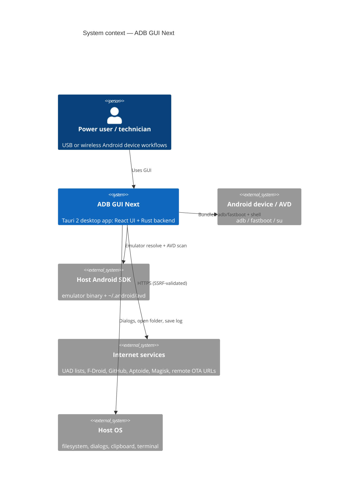
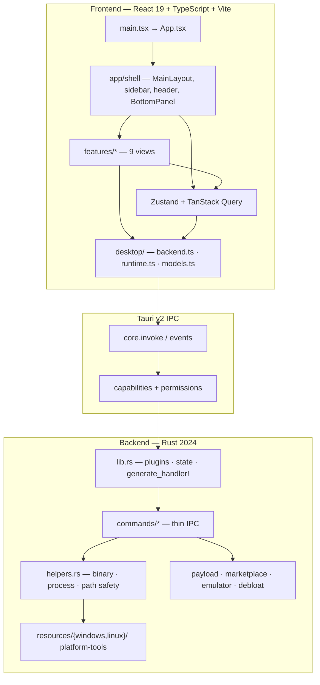
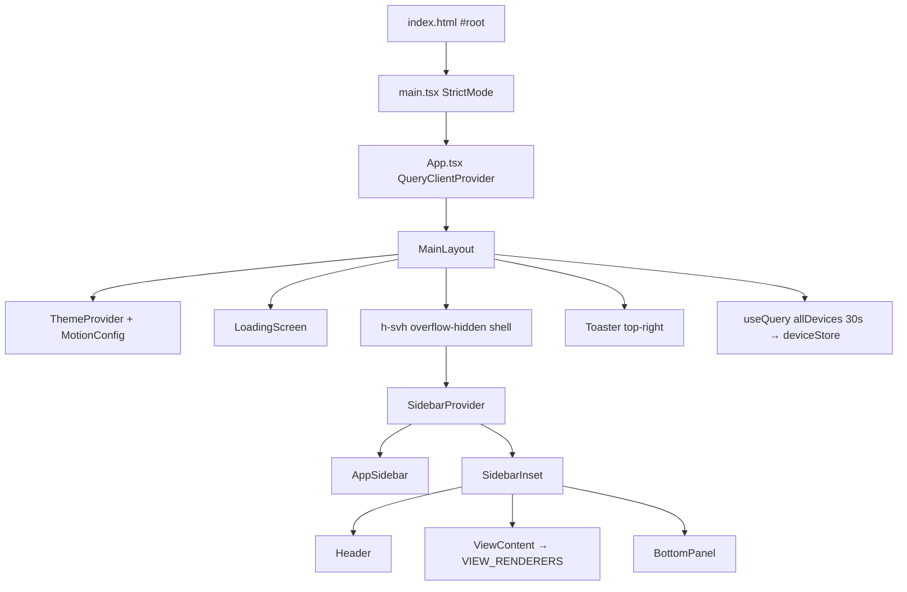
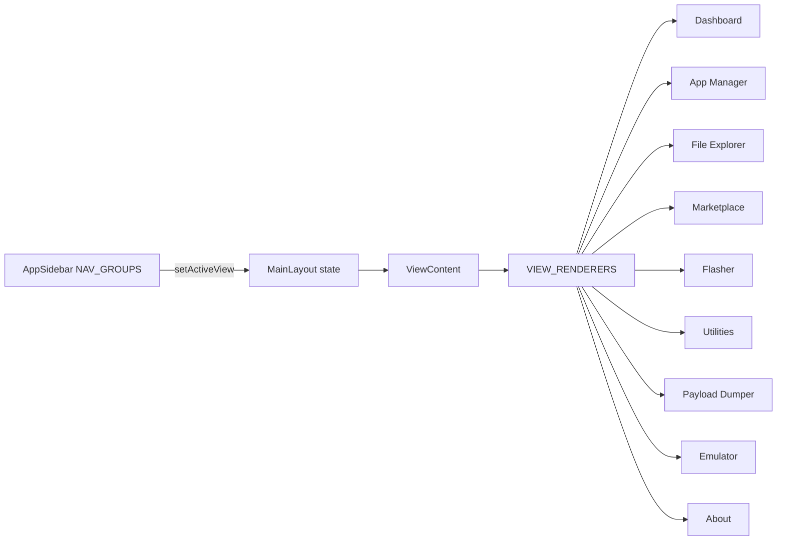
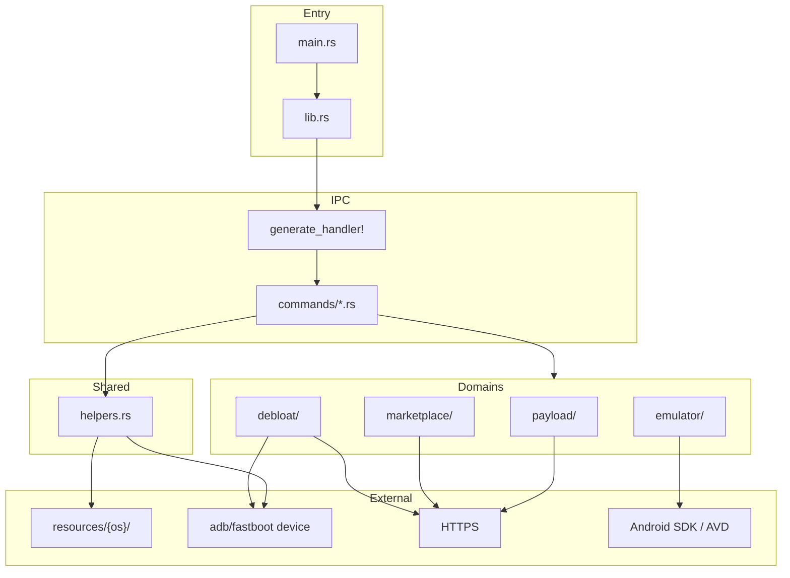
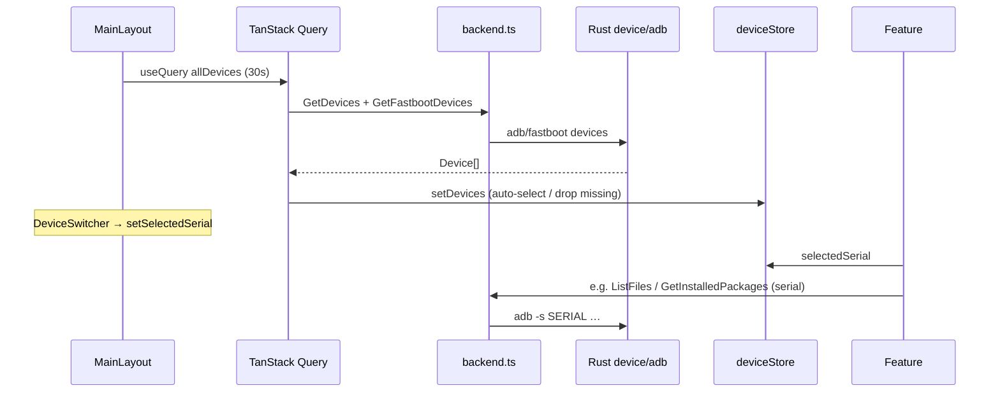
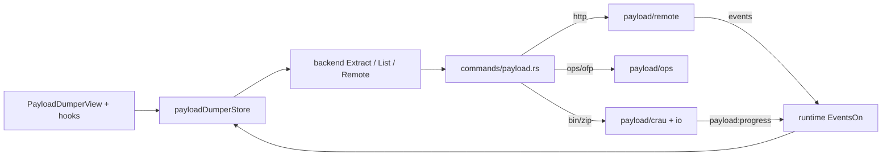
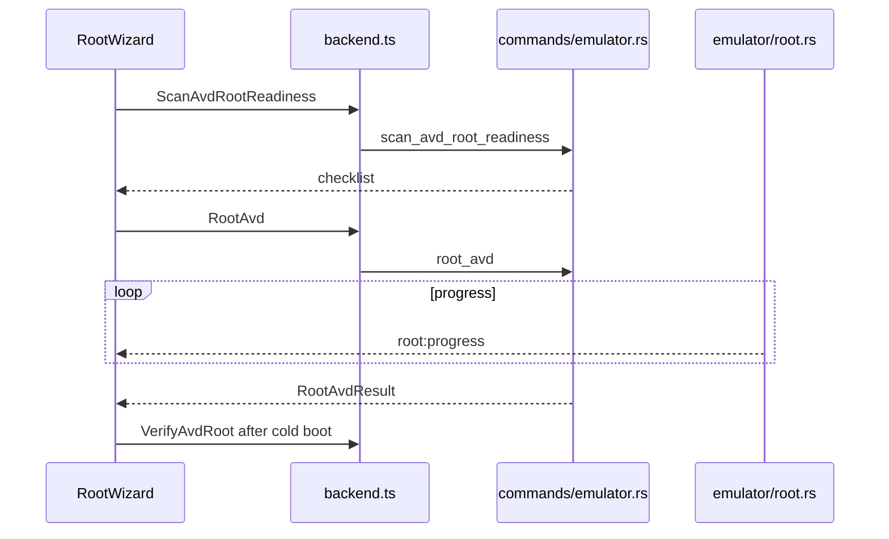

# ADB GUI Next — Architecture

> **Product:** Desktop toolkit for ADB, fastboot, firmware extraction, debloat, marketplace, and emulator workflows  
> **Version:** 0.2.5  
> **Stack:** Tauri 2 · React 19 · TypeScript · Vite 8 · Rust 2024 · Bun  
> **Platforms:** Windows & Linux first-class · macOS out of product scope  
> **Source of truth:** This document describes the **current** tree under `src/` and `src-tauri/`.

---

## Table of contents

1. [Purpose and scope](#1-purpose-and-scope)
2. [System context](#2-system-context)
3. [High-level architecture](#3-high-level-architecture)
4. [Technology stack](#4-technology-stack)
5. [Repository layout](#5-repository-layout)
6. [Frontend architecture](#6-frontend-architecture)
7. [Desktop IPC layer](#7-desktop-ipc-layer)
8. [Rust backend architecture](#8-rust-backend-architecture)
9. [Feature map (end-to-end)](#9-feature-map-end-to-end)
10. [Cross-cutting data flows](#10-cross-cutting-data-flows)
11. [Security and safety model](#11-security-and-safety-model)
12. [UI shell and layout model](#12-ui-shell-and-layout-model)
13. [Quality, tooling, and CI](#13-quality-tooling-and-ci)
14. [Architectural decisions](#14-architectural-decisions)
15. [Known limitations](#15-known-limitations)
16. [Where to change what](#16-where-to-change-what)

---

## 1. Purpose and scope

ADB GUI Next is a **native desktop application** (not a web product). It wraps Android platform tools and domain logic behind a modern React UI:

| Capability | Summary |
| --- | --- |
| Device control | Discover ADB/fastboot devices, select target, view info, wireless ADB |
| App Manager | Install / uninstall packages; Universal Android Debloater (UAD) integration |
| File Explorer | Dual-pane browse, push/pull, mutate, optional verified root mode |
| Flasher | Fastboot flash, recovery sideload, wipe, A/B slot |
| Utilities | Reboot modes, host tools, bootloader vars, terminal/device manager launch |
| Payload Dumper | Local/remote OTA `payload.bin`, factory ZIPs, OnePlus OPS, Oppo OFP |
| Marketplace | Discover/install APKs from F-Droid, GitHub, Aptoide (+ optional GitHub auth) |
| Emulator Manager | AVD list/launch/stop, Magisk root wizard, backup restore |
| Bottom panel | Logs + adb/fastboot shell (VS Code–style) |

**Out of scope:** browser deployment, Next.js routing, Electron, macOS as a supported product target.

---

## 2. System context



### ASCII — external actors

```text
                    ┌──────────────────────┐
                    │   User (desktop UI)  │
                    └──────────┬───────────┘
                               │
                    ┌──────────▼───────────┐
                    │    ADB GUI Next      │
                    │  React  │  Rust      │
                    └─┬────┬────┬────┬─────┘
          bundled     │    │    │    │
          adb/fastboot│    │    │    │ HTTPS (validated)
                      │    │    │    │
          ┌───────────▼┐ ┌─▼──┐ │  ┌─▼──────────────┐
          │ Device/AVD │ │SDK │ │  │ UAD / market / │
          │ ADB shell  │ │AVD │ │  │ Magisk / OTA   │
          └────────────┘ └────┘ │  └────────────────┘
                                │
                         ┌──────▼──────┐
                         │ Host OS FS  │
                         │ dialogs     │
                         └─────────────┘
```

---

## 3. High-level architecture

The system is a **layered Tauri 2 app**: UI never shells out directly; all process and domain work is Rust. The frontend keeps a thin, typed **desktop** boundary.



### Canonical request path

```text
UI event
  → feature view / hook / store
  → src/desktop/backend.ts   (typed invoke)
  → Tauri command (commands/*.rs)
  → helpers.rs and/or domain module
  → result / emitted event
  → store update · logStore · Sonner toast
```

### ASCII — process layers

```text
┌─────────────────────────────────────────────────────────────────┐
│  WEBVIEW (React)                                                │
│  app/shell  ·  features/*  ·  shared/*  ·  desktop/*            │
├─────────────────────────────────────────────────────────────────┤
│  TAURI IPC  ·  ACL  ·  plugins (dialog, log, opener, clipboard) │
├─────────────────────────────────────────────────────────────────┤
│  RUST LIBRARY (adb_gui_next_lib)                                │
│  commands/ (thin) → helpers + domain modules                    │
├─────────────────────────────────────────────────────────────────┤
│  OS / DEVICE / NETWORK                                          │
│  adb · fastboot · emulator · HTTPS · host FS                    │
└─────────────────────────────────────────────────────────────────┘
```

---

## 4. Technology stack

| Layer | Choices |
| --- | --- |
| UI | React 19, TypeScript 6, Vite 8, Tailwind CSS v4, shadcn/ui (Radix), Framer Motion, Sonner, next-themes |
| Client state | Zustand 5 (UI + feature state), TanStack Query 5 (device + AVD polls) |
| Forms / schema | React Hook Form, Zod |
| Lists | `@tanstack/react-virtual`, `cmdk` (with `shouldFilter={false}` when virtualized) |
| Desktop bridge | `@tauri-apps/api` 2.11, plugins: dialog, opener, clipboard, log |
| Backend | Rust edition 2024, Tauri 2, tokio, reqwest (rustls), memmap2, prost, rayon, zip/zstd/liblzma/… |
| Package manager | Bun (`packageManager`: bun@1.3.13) |
| Quality | Ultracite (Biome) FE; rustfmt + clippy; Vitest; Husky + lint-staged |

---

## 5. Repository layout

```text
adb-gui-next/
├── src/                          # Frontend
│   ├── main.tsx                  # React mount
│   ├── app/                      # App shell only
│   │   ├── App.tsx               # QueryClientProvider
│   │   └── shell/                # MainLayout, views, BottomPanel, Header
│   ├── desktop/                  # ONLY place for raw Tauri invoke/events
│   │   ├── backend.ts            # invoke wrappers + native dialogs
│   │   ├── runtime.ts            # EventsOn, OnFileDrop, BrowserOpenURL
│   │   └── models.ts             # IPC DTOs (namespace backend)
│   ├── features/<name>/          # Product features (View + hooks/model/ui/utils)
│   ├── shared/
│   │   ├── components/           # Cross-feature composites
│   │   ├── stores/               # App-wide Zustand
│   │   ├── ui/                   # shadcn primitives
│   │   └── utils/                # queries, errorHandler, cn, …
│   ├── styles/global.css         # Tailwind v4 + semantic tokens
│   └── test/                     # All Vitest tests
├── src-tauri/
│   ├── src/
│   │   ├── main.rs               # Binary entry
│   │   ├── lib.rs                # Bootstrap + generate_handler!
│   │   ├── helpers.rs            # Shared process/path helpers
│   │   ├── commands/             # Thin Tauri command modules
│   │   ├── payload/              # Firmware extract domain
│   │   ├── marketplace/          # App discovery domain
│   │   ├── emulator/             # AVD + Magisk root domain
│   │   └── debloat/              # UAD domain
│   ├── resources/{windows,linux,darwin}/
│   ├── capabilities/default.json
│   ├── permissions/autogenerated.toml
│   └── tauri*.conf.json
├── package.json                  # Scripts, lint-staged, deps
└── biome.jsonc                   # Ultracite/Biome config
```

### Hard boundaries

| Concern | Correct location | Do not |
| --- | --- | --- |
| Bootstrap | `src/main.tsx`, `src/app/App.tsx` | Feature logic in bootstrap |
| Shell / view switch | `src/app/shell/` | React Router / per-view device polls |
| Feature UI | `src/features/<feature>/` | Legacy `components/views` |
| Raw `invoke` / events | `src/desktop/*` only | Scatter in features |
| shadcn primitives | `src/shared/ui/` | Hand-roll base controls |
| Cross-feature stores | `src/shared/stores/` | App-wide state inside one feature |
| Tauri commands | `src-tauri/src/commands/*.rs` | Fat handlers in domain |
| Domain logic | `payload/`, `marketplace/`, `emulator/`, `debloat/` | Inline complex logic in commands |
| Shared process helpers | `helpers.rs` | Duplicate adb spawn / path sanitize |
| FE tests | `src/test/` | Tests next to components |

---

## 6. Frontend architecture

### 6.1 Bootstrap



| File | Role |
| --- | --- |
| `src/main.tsx` | Mount only |
| `src/app/App.tsx` | Global `QueryClient` (`staleTime: 0`, `gcTime: 5m`, `retry: 1`) |
| `src/app/shell/MainLayout.tsx` | Shell, device poll, view state, layout chrome |

### 6.2 Navigation — no router

Views are **not** URL routes. `MainLayout` holds `useState<ViewType>` and renders via a map.

```text
src/app/shell/viewConfig.tsx

VIEWS = dashboard | apps | files | marketplace | flasher
      | utils | payload | emulator | about

VIEW_RENDERERS[view] → feature *View component
```



**Nav groups** (`AppSidebar`): Main = dashboard / apps / files / marketplace · Advanced = flasher / utils / emulator / payload · Footer = about.

Active view is **ephemeral** (full reload returns to dashboard).

### 6.3 Feature module shape

```text
src/features/<feature>/
├── <Feature>View.tsx     # Page orchestrator
├── hooks/                # Stateful feature logic
├── model/                # Zustand store / types / constants (when needed)
├── ui/                   # Presentational components
└── utils/                # Pure helpers
```

| Feature | Entry | Primary state |
| --- | --- | --- |
| dashboard | `DashboardView.tsx` | `deviceStore`, `wirelessAdbStore` |
| app-manager | `AppManagerView.tsx` | `installationStore`, `debloatStore` (tabs) |
| file-explorer | `FileExplorerView.tsx` | Local hooks + `localStorage` path prefs |
| marketplace | `MarketplaceView.tsx` | `marketplaceStore` + search/auth hooks |
| flasher | `FlasherView.tsx` | Local hooks |
| utilities | `UtilitiesView.tsx` | Local hooks |
| payload-dumper | `PayloadDumperView.tsx` | `payloadDumperStore` + event hooks |
| emulator | `EmulatorView.tsx` | `emulatorManagerStore` + Query AVD list |
| about | `AboutView.tsx` | Stateless / opener |

### 6.4 State management

```text
┌────────────────────────────────────────────────────────────┐
│ TanStack Query                                             │
│  · allDevices poll in MainLayout (30s)                     │
│  · AVD list poll in EmulatorView (5s)                      │
│  · queryKeys + STALE_TIME in shared/utils/queries.ts       │
└───────────────────────────┬────────────────────────────────┘
                            │ setDevices / invalidate*
┌───────────────────────────▼────────────────────────────────┐
│ Zustand                                                    │
│  shared/stores: device · log · shell · wirelessAdb         │
│  feature model/: debloat · installation · marketplace ·    │
│                 payloadDumper · emulatorManager            │
│  nicknameStore: localStorage helpers (not Zustand)         │
└────────────────────────────────────────────────────────────┘
```

**Rules of thumb**

- **One global device poll** — only `MainLayout`. Features must not add competing device intervals.
- **Serial targeting** — features read `selectedSerial` from `deviceStore` and pass it into desktop wrappers.
- **Marketplace search** is hook-orchestrated (debounce + stale-response protection), not primarily Query-driven.
- **GitHub PAT / OAuth access tokens** are session-only (must not land in localStorage).

### 6.5 Error and feedback

```text
Tauri invoke failure
  → try/catch in feature/hook
  → handleError / handleSuccess (shared/utils/errorHandler.ts)
  → logStore.addLog + Sonner toast
```

---

## 7. Desktop IPC layer

All Tauri surface area is concentrated in `src/desktop/`.

| Module | Responsibility |
| --- | --- |
| `backend.ts` | `core.invoke<T>(command, args)` wrappers + dialog helpers |
| `models.ts` | TypeScript DTOs under `namespace backend` (camelCase) |
| `runtime.ts` | `EventsOn` / `EventsOff`, window-level `OnFileDrop`, `BrowserOpenURL` |

### Invoke pattern

```ts
// Pattern in backend.ts
function call<T>(command: string, args?: Record<string, unknown>): Promise<T> {
  return core.invoke<T>(command, args);
}

export function GetDevices(): Promise<backend.Device[]> {
  return call('get_devices');
}

export function ListFiles(
  path: string,
  serial?: string | null,
  accessMode: backend.FileAccessMode = 'normal',
): Promise<backend.FileEntry[]> {
  return call('list_files', { path, serial, accessMode });
}
```

- Rust command names: **snake_case**
- Argument keys / DTO fields: **camelCase** (serde `rename_all = "camelCase"`)

### Events (use `runtime.ts` only)

| Event | Domain |
| --- | --- |
| `payload:progress` | Extraction progress |
| `payload:load-progress` | Remote metadata / list load |
| `root:progress` | Emulator Magisk root pipeline |

### Drag-and-drop

Tauri drag/drop is **window-level**. Pattern:

1. One `OnFileDrop()` registration per active page (re-registering replaces the handler).
2. Hit-test cursor `(x, y)` against element `getBoundingClientRect()` on **hover and drop**.
3. Multiple drop zones on one page → single handler + multiple refs.

---

## 8. Rust backend architecture

### 8.1 Bootstrap (`lib.rs`)

```text
main.rs
  └── adb_gui_next_lib::run()
        ├── fix_path_env
        ├── plugins: log · dialog · opener · clipboard_manager
        ├── .manage:
        │     PayloadCache
        │     ManagedMarketplaceCache
        │     ManagedHttpClient
        │     DebloatCache
        ├── setup: window icon
        ├── generate_handler![ ~70 commands ]
        └── on Exit: PayloadCache.cleanup()
```

```rust
// Global IPC error type
pub type CmdResult<T> = Result<T, String>;
```

### 8.2 Layering



### 8.3 Command modules

| Module | Responsibility |
| --- | --- |
| `commands/device.rs` | Device list, info, mode; serial helpers for other modules |
| `commands/adb.rs` | Wireless ADB, host/shell runners |
| `commands/fastboot.rs` | Flash, reboot, wipe, slots, fastboot host |
| `commands/files.rs` | Explorer list/push/pull/mutate + root verify |
| `commands/apps.rs` | Packages install/uninstall/sideload/list |
| `commands/system.rs` | Open folder, terminal, device manager, save log |
| `commands/payload.rs` | List/extract/remote/cancel tokens (thin over `payload/`) |
| `commands/marketplace.rs` | Search/detail/download/install/auth (thin over `marketplace/`) |
| `commands/emulator.rs` | AVD lifecycle + root wizard IPC |
| `commands/debloat.rs` | UAD data + actions + backups |

Commands are **thin**. Blocking work uses `tokio::task::spawn_blocking` or `block_in_place` as appropriate.

### 8.4 Domain modules

#### Payload (`src-tauri/src/payload/`)

```text
payload/
├── crau/          # CrAU payload.bin parse + extract
├── ops/           # OnePlus OPS + Oppo OFP (QC/MTK), sparse
├── remote/        # HTTP range, remote ZIP, factory images, SSRF URL validation
├── source/        # Local mmap / STORED windows
├── zip/           # Local ZIP extract + PayloadCache
├── io/            # Writers, copy paths, buffer pools
├── verify/        # Integrity layers
├── delta/         # Delta OTA helpers
├── cancel.rs      # CancellationToken
├── transaction.rs # TransactionGuard — deletes registered files only
└── types.rs       # Shared serde DTOs
```

Routing idea: local path → OPS/OFP detector or CrAU; HTTP URL → remote pipeline (OTA or factory image when no `payload.bin`).

#### Marketplace (`src-tauri/src/marketplace/`)

```text
service  →  providers (fdroid, github, aptoide, …)
         →  ranking · cache · auth
ManagedHttpClient  — connection-pooled reqwest
```

Install path: download to owned temp → `marketplace_install_apk` only accepts paths under that temp root → `adb install` with selected serial.

#### Emulator (`src-tauri/src/emulator/`)

```text
sdk.rs       Resolve ANDROID_SDK_ROOT / ANDROID_HOME / defaults
avd.rs       Scan ~/.android/avd/*.ini  (not emulator -list-avds)
runtime.rs   Launch / stop / map running serials
backup.rs    Restore plans for root pipeline artifacts
root.rs      Magisk ramdisk patch pipeline + progress events
magisk_*     Package download/unpack (local zip → GitHub latest → offline fallback)
```

Emulator binary is **not** bundled; ADB/fastboot **are**.

#### Debloat (`src-tauri/src/debloat/`)

```text
lists · sync · actions · backup · cache (device-serial keyed)
```

SDK-aware action builder; refuse Disable when SDK unknown or API &lt; 23.

### 8.5 Shared helpers (`helpers.rs`)

| Helper | Why it exists |
| --- | --- |
| `resolve_binary_path` | Packaged resources → dev `src-tauri/resources/{os}` → PATH |
| `run_binary_command*` | Spawn with Windows `CREATE_NO_WINDOW` where needed |
| `adb_shell_checked` | Host success ≠ shell success (`__ADB_GUI_EXIT_STATUS__`) |
| `sanitize_filename` / `safe_image_file_name` | Safe extract basenames |
| `validate_path_components` / `validate_safe_device_path` | Traversal + write-path allowlist |

### 8.6 Bundled resources

```text
src-tauri/resources/
├── windows/   adb.exe, fastboot.exe, DLLs, label_reader.jar, …
├── linux/     adb, fastboot, …
└── darwin/    present in tree; product still Win/Linux first-class
```

Wired via `tauri.windows.conf.json` / `tauri.linux.conf.json`.

### 8.7 IPC contract conventions

| Topic | Convention |
| --- | --- |
| Return type | `CmdResult<T> = Result<T, String>` |
| Field names | `#[serde(rename_all = "camelCase")]` on IPC structs |
| Tagged enums | Tag **values** rename too (e.g. `latestStable`) — TS unions must match |
| Permissions | Every command in `generate_handler!` **and** `permissions/autogenerated.toml` `commands.allow` |
| Capability | `capabilities/default.json` → main window + plugin defaults + `allow-all` |

---

## 9. Feature map (end-to-end)

| Area | Frontend | Store / state | Desktop | Rust |
| --- | --- | --- | --- | --- |
| Device / Dashboard | `features/dashboard` · `DeviceSwitcher` | `deviceStore`, `wirelessAdbStore` | `GetDevices`, `GetDeviceInfo`, wireless cmds | `device`, `adb` |
| App Manager | `features/app-manager` | `installationStore` | package list/install/uninstall | `apps` |
| Debloat | `app-manager/debloater` | `debloatStore` | `GetDebloatData`, actions, backups | `debloat` domain |
| File Explorer | `features/file-explorer` | hooks + localStorage | list/push/pull/mutate/root | `files` + helpers |
| Flasher | `features/flasher` | local | flash/sideload/wipe + DnD | `fastboot`, `apps` |
| Utilities | `features/utilities` | local | reboot, host cmds, wipe | `adb`, `fastboot`, `system` |
| Payload Dumper | `features/payload-dumper` | `payloadDumperStore` | list/extract/remote/cancel | `payload` domain |
| Marketplace | `features/marketplace` | `marketplaceStore` | search/download/install/auth | `marketplace` domain |
| Emulator | `features/emulator` | `emulatorManagerStore` | AVD + root wizard | `emulator` domain |
| Logs / Shell | `app/shell/BottomPanel` | `logStore`, `shellStore` | shell/host cmds, `SaveLog` | `adb`, `fastboot`, `system` |

---

## 10. Cross-cutting data flows

### 10.1 Device poll → selection → device-scoped op



### 10.2 Payload extract (local / remote / OPS)



### 10.3 Emulator root wizard



### 10.4 Marketplace install

```text
Search/Detail (marketplace/service + providers)
  → MarketplaceDownloadApk (owned temp, SSRF-safe URL)
  → MarketplaceInstallApk(path, selectedSerial)
  → adb install -s SERIAL
```

---

## 11. Security and safety model

```text
┌──────────────────────────────────────────────────────────┐
│ Webview CSP + freezePrototype (tauri.conf.json)          │
├──────────────────────────────────────────────────────────┤
│ Capability: main window only + plugin defaults + allow-all│
│ Permission TOML must list every custom command           │
├──────────────────────────────────────────────────────────┤
│ Process safety                                           │
│  · Bundled adb/fastboot resolution                       │
│  · adb_shell_checked for mutations / root ops            │
│  · Path traversal rejects · device write allowlist       │
│  · safe_image_file_name on extract outputs               │
│  · TransactionGuard: no remove_dir_all on user dirs      │
├──────────────────────────────────────────────────────────┤
│ Network safety                                           │
│  · validate_outbound_url (host + resolved IP)            │
│  · Manual redirects; re-validate each hop                │
│  · Marketplace install only owned temp paths             │
├──────────────────────────────────────────────────────────┤
│ Debloat safety                                           │
│  · Device-keyed cache                                    │
│  · Fail closed when SDK unknown; no Disable on API < 23  │
└──────────────────────────────────────────────────────────┘
```

**BrowserOpenURL** allows only `http:` / `https:` via the opener plugin.

---

## 12. UI shell and layout model

The app is **viewport-locked**. Incorrect overflow breaks sticky semantics and full-height features.

```text
┌─ h-svh overflow-hidden ──────────────────────────────────┐
│ SidebarProvider h-full                                   │
│ ┌─sidebar─┬─ SidebarInset min-w-0 overflow-x-hidden ───┐ │
│ │         │  Header shrink-0 (pinned)                   │ │
│ │  nav    │  ┌─ main-scroll-area flex-1 ─────────────┐  │ │
│ │         │  │  ViewContent → feature view           │  │ │
│ │         │  └───────────────────────────────────────┘  │ │
│ └─────────┴─────────────────────────────────────────────┘ │
│  BottomPanel fixed (sidebar-aware left) — not on About    │
└───────────────────────────────────────────────────────────┘
```

| Rule | Detail |
| --- | --- |
| Outer boundary | `h-svh overflow-hidden` |
| Header | Structural pin (`shrink-0`), not `position: sticky` |
| Main scroll | Default `overflow-y-auto`; File Explorer & Marketplace own internal scroll |
| `min-w-0` | Required chain so truncating text works |
| Bottom panel resize | **DOM-first** during drag; React state on mouseup only |
| Toasts | Sonner top-right in `MainLayout` |
| Theme tokens | `src/styles/global.css` semantic colors (no raw hex in components) |

---

## 13. Quality, tooling, and CI

### Scripts model

| Intent | Command |
| --- | --- |
| FE check | `bun run lint:web` (`ultracite check`) |
| FE fix | `bun run format:web` (`ultracite fix`) |
| Rust lint | `bun run lint:rust` (clippy `-D warnings`) |
| Rust format | `bun run format:rust` / `format:rust:check` |
| Combined | `bun run lint`, `bun run format`, `bun run format:check` |
| Full gate | `bun run check` (format:check → clippy → vitest → cargo test → build) |

Full gate (`bun run check`) is for complete change sets, not mid-implementation checkpoints.

### Pre-commit (Husky + lint-staged)

```text
git commit
  → .husky/pre-commit
  → bun x lint-staged
       staged *.{js,jsx,ts,tsx,json,jsonc,css} → ultracite fix
       staged src-tauri/**/*.rs               → cargo fmt
```

Does **not** run clippy, full-repo checks, or tests. CI owns the heavy bar.

### CI (GitHub Actions)

| Job | When | What |
| --- | --- | --- |
| `quality` | All branches + PRs | format:check, lint, FE tests, cargo test, vite build (Ubuntu) |
| `package` | **main push only** | Windows nsis/msi + Linux deb/rpm artifacts |
| `publish` | Manual | Full preflight; Win/Linux always; macOS if Apple secrets |

### Rust lint bar

- `Cargo.toml` `[lints]` — `unsafe_code = warn`; clippy `unwrap_used` / `expect_used` + pedantic cherry-picks  
- `clippy.toml` — allow unwrap/expect in tests  

---

## 14. Architectural decisions

| Decision | Rationale |
| --- | --- |
| Tauri 2 over Electron | Small installer (~30 MB class), Rust backend, OS webview |
| No React Router | Single-window toolkit; view map is enough |
| `desktop/` IPC facade | One typed boundary; ACL + models stay coherent |
| Thin commands + fat domains | Testable domain logic; IPC stays boring |
| Bundled platform-tools | Standalone installs without system ADB |
| Ultracite (Biome) for FE | Single tool for format + lint; replaces ESLint/Prettier stack |
| Zustand + selective Query | Client UI state local; only device/AVD need interval polls |
| Device serial on commands | Multi-device safety for ADB/fastboot ops |
| Events via `runtime.ts` | Consistent subscribe/dispose; no raw event scatter |
| Payload streaming/mmap | Large firmware without loading whole images into RAM |
| Cancel tokens required when used | Invalid token IDs error; never silent uncancellable runs |

---

## 15. Known limitations

| Topic | Detail |
| --- | --- |
| macOS | Not a first-class product target (resources may exist for experiments) |
| Debloat multi-device | FE reloads on `selectedSerial`, but some Rust debloat paths historically use default `adb get-serialno` rather than explicit FE serial — treat multi-device debloat carefully |
| Windows `cargo test` | Known Tauri-linked loader failure (`0xc0000139` / `STATUS_ENTRYPOINT_NOT_FOUND`) can block execution; prefer `--no-run` + Linux CI |
| Active view not persisted | Reload returns to dashboard |
| `OnFileDrop` single owner | Only one window handler active; pages must re-register carefully |
| Delta OTA | Domain hooks exist; full “real work” path may be limited vs full CrAU extract |

---

## 16. Where to change what

| You want to… | Start here |
| --- | --- |
| Add a sidebar view | `viewConfig.tsx` + `AppSidebar` + `src/features/<new>/` |
| Add a Tauri command | `commands/<mod>.rs` → `lib.rs` handler → `permissions/autogenerated.toml` → `desktop/backend.ts` + `models.ts` |
| Change device polling | `MainLayout.tsx` + `shared/utils/queries.ts` only |
| Add domain extract format | `payload/` submodule + thin `commands/payload.rs` |
| New marketplace provider | `marketplace/<provider>.rs` + `service.rs` (not command body) |
| Emulator root behavior | `emulator/root.rs` + FE `RootWizard` via `runtime` events |
| Shared UI primitive | `src/shared/ui/` (shadcn) |
| Theme / color | `src/styles/global.css` tokens |
| Layout bug (scroll/header) | `MainLayout` / `ViewContent` flex chain first |

---

## Appendix A — Full command surface (invoke names)

Registered in `src-tauri/src/lib.rs` `generate_handler!` (authoritative list):

```text
Device / ADB / Fastboot
  get_devices, get_fastboot_devices, get_device_info, get_device_mode
  connect_wireless_adb, disconnect_wireless_adb, enable_wireless_adb
  run_adb_host_command, run_shell_command, run_fastboot_host_command
  flash_partition, get_bootloader_variables, reboot, set_active_slot, wipe_data

Files
  list_files, push_file, pull_file, create_file, create_directory
  delete_files, rename_file, verify_file_root_access

Apps
  get_installed_packages, install_package, uninstall_package, sideload_package

System
  open_folder, launch_terminal, launch_device_manager, save_log

Payload
  list_payload_partitions, list_payload_partitions_with_details
  extract_payload, extract_delta_payload, diagnose_payload, get_ops_metadata
  check_remote_payload, get_remote_payload_metadata, list_remote_payload_partitions
  create_cancellation_token, cancel_extraction, cleanup_payload_cache

Marketplace
  marketplace_search, marketplace_get_app_detail, marketplace_list_versions
  marketplace_clear_cache, marketplace_github_device_start, marketplace_github_device_poll
  marketplace_download_apk, marketplace_install_apk

Emulator
  list_avds, launch_avd, stop_avd, get_avd_restore_plan, restore_avd_backups
  fetch_magisk_stable_release, root_avd, scan_avd_root_readiness, verify_avd_root
  prepare_avd_root, finalize_avd_root

Debloat
  load_debloat_lists, get_debloat_packages, debloat_packages
  create_debloat_backup, list_debloat_backups, restore_debloat_backup
  get_debloat_device_settings, save_debloat_device_settings
  get_debloat_data, refresh_debloat_data, get_device_sdk
```

---

*Update this file when boundaries, command surface, or shell layout change.*
